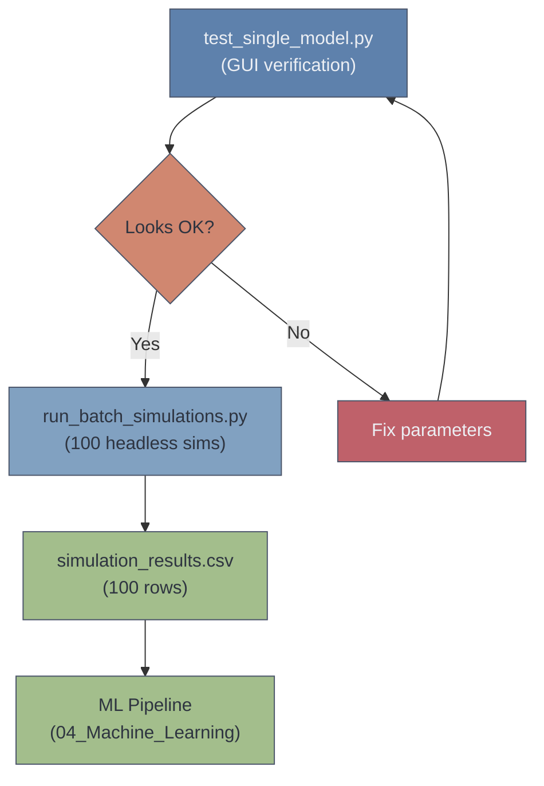
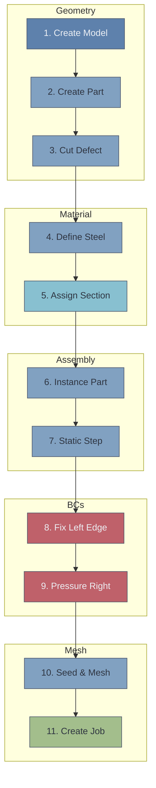
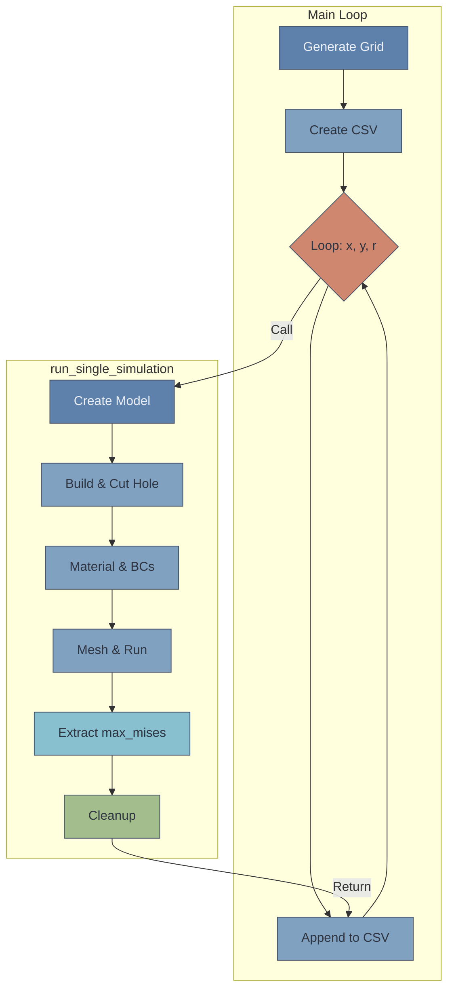

> [!info] Document Metadata
> **Purpose:** V1 Abaqus simulation pipeline — circular holes in isotropic steel plate
> **Scripts:** `test_single_model.py` (GUI verification), `run_batch_simulations.py` (headless batch)
> **Status:** ✅ Complete — 100 samples generated, ML pipeline run
> **Created:** January 2026 (documented 31 January 2026)
> **Related:** [[V2 — Elliptical Defects & Enhanced Pipeline]], [[V1 — Circular Holes & Initial Pipeline#Analytical Validation — Kirsch & Heywood|Analytical Validation (Kirsch & Heywood)]]

---

## Overview

V1 is the foundation of the entire project — a simple parametric study of a steel plate with a single circular hole under uniaxial tension. It establishes all the core patterns (geometry creation, stress extraction, CSV output, cleanup) that V2–V4 build upon.



---

## V1 Configuration

### Geometry & Material

| Parameter | Value | Units | Description |
|-----------|-------|-------|-------------|
| `PLATE_LENGTH` | 100.0 | mm | X direction |
| `PLATE_WIDTH` | 50.0 | mm | Y direction |
| `PLATE_THICKNESS` | 2.0 | mm | Z direction |
| `YOUNGS_MODULUS` | 210,000 | MPa | Steel |
| `POISSONS_RATIO` | 0.3 | — | Steel |
| `YIELD_STRENGTH` | 250.0 | MPa | Failure threshold |
| `APPLIED_PRESSURE` | 100.0 | MPa | Right face |
| `ELEMENT_SIZE` | 3.0 | mm | Uniform mesh |

### Parameter Space (3 inputs, grid sampling)

| Parameter | Min | Max | Count | Values |
|-----------|-----|-----|-------|--------|
| `defect_x` | 20 mm | 80 mm | 5 | 20, 35, 50, 65, 80 |
| `defect_y` | 10 mm | 40 mm | 5 | 10, 17.5, 25, 32.5, 40 |
| `defect_radius` | 2 mm | 8 mm | 4 | 2, 4, 6, 8 |

$$\text{Total Simulations} = 5 \times 5 \times 4 = 100$$

> [!tip] Why These Ranges?
> - **X range (20–80):** Keeps hole away from fixed (left) and loaded (right) edges
> - **Y range (10–40):** Keeps hole away from top and bottom edges
> - **Radius range (2–8):** Small enough to fit, large enough to cause measurable stress concentration

### CSV Output (6 columns)

```csv
sim_id,defect_x,defect_y,defect_radius,max_mises,failed
1,20.00,10.00,2.00,156.34,0
2,20.00,10.00,4.00,189.78,0
...
```

| Column | Type | Description |
|--------|------|-------------|
| `sim_id` | int | Unique simulation identifier |
| `defect_x` | float | Hole centre X (mm) |
| `defect_y` | float | Hole centre Y (mm) |
| `defect_radius` | float | Hole radius (mm) |
| `max_mises` | float | Maximum von Mises stress (MPa) |
| `failed` | int | 1 if max_mises > 250 MPa, else 0 |

> [!note] Class Distribution
> - Not Failed (0): 89 samples (89%)
> - Failed (1): 11 samples (11%)

---

## Test Script — Visual Verification

**Script:** `test_single_model.py`
**Run command:** `abaqus cae script=test_single_model.py`

Creates a single plate model with a centred hole (x=50, y=25, r=5) and displays it in the Abaqus GUI for visual inspection before committing to batch runs.

### The 11-Step Workflow



### What to Check Visually

| Module | Verification |
|--------|-------------|
| **Part** | Plate is 100×50×2 mm box with hole at centre |
| **Property** | Section assigned (green colour) |
| **Assembly** | Instance placed correctly |
| **Step** | LoadStep exists after Initial |
| **Load** | Pressure arrows on right face |
| **BC** | Fixed symbols on left face |
| **Mesh** | Elements cover entire part |

### After Running: Troubleshooting

| Problem | Likely Cause | Fix |
|---------|--------------|-----|
| No hole visible | `findAt` coordinates wrong | Check DEFECT_X, DEFECT_Y are within plate |
| Mesh failed | Hole too close to edge | Increase margin from edges |
| No BC symbols | Wrong face selected | Check `findAt` coordinates for left face |
| Job fails | Element distortion | Reduce ELEMENT_SIZE or increase hole distance from edge |

---

## Batch Script — Data Generation

**Script:** `run_batch_simulations.py`
**Run command:** `abaqus cae noGUI=run_batch_simulations.py`
**Output:** `simulation_results.csv` (100 rows)

Runs all 100 parameter combinations headlessly, extracting max von Mises stress from each and writing results to CSV.

### Script Architecture



### Expected Runtime

| Simulations | Approximate Time |
|-------------|------------------|
| 100 | 1–2 hours |
| 500 | 4–8 hours |

### Stress Extraction

The script extracts the maximum von Mises stress by iterating over all stress field values:

```python
stress_field = frame.fieldOutputs['S']
max_mises = 0.0
for value in stress_field.values:
    if value.mises > max_mises:
        max_mises = value.mises
```

> [!warning] V1 Limitation
> This iterates over integration points directly via `.values` — a simpler but less precise approach than the ELEMENT_NODAL method introduced in V2. The V2 upgrade extracts nodal stresses with proper coordinate tracking.

### Memory Management

Each simulation cleans up after itself:
1. `del mdb.models[model_name]` — remove the model from memory
2. Delete temporary files (`.odb`, `.lck`, `.res`, `.prt`, `.sim`, `.sta`, `.msg`, `.dat`, etc.)
3. `gc.collect()` — force Python garbage collection

> [!warning] For Large Datasets (500+ simulations)
> Abaqus doesn't release memory perfectly. If memory grows:
> 1. Run in batches of ~100 simulations
> 2. Restart Abaqus between batches
> 3. Merge CSV files afterward

---

## Run Commands

**GUI test (visual verification):**
```bash
abaqus cae script=test_single_model.py
```

**Headless batch (data generation):**
```bash
abaqus cae noGUI=run_batch_simulations.py
```

---

## Patterns Established in V1

These patterns are carried forward to all subsequent versions:

| Pattern | Purpose | V2+ Status |
|---------|---------|------------|
| CutExtrude for hole geometry | Cut holes through plate | ✅ Evolved to single-sketch multi-hole in V2+ |
| Grid parameter sampling | Cover parameter space | ✅ Replaced by LHS in V2+ |
| Headless batch processing | Automated data generation | ✅ Same approach in all versions |
| CSV output with failure flag | ML-ready dataset | ✅ Expanded columns in V2+ |
| Model cleanup + gc.collect() | Memory management | ✅ Same in all versions |
| `findAt()` for face/edge selection | Robust geometry selection | ✅ Same in all versions |

---

## Limitations Addressed in Later Versions

| V1 Limitation | Addressed In | How |
|---------------|-------------|-----|
| Circular holes only | V2 | Elliptical defects with aspect ratio and angle |
| 3 inputs only | V2 | 7 inputs (added aspect_ratio, angle, thickness, pressure) |
| Grid sampling (uneven coverage) | V2 | Latin Hypercube Sampling |
| No stress location tracking | V2 | ELEMENT_NODAL extraction with x/y/z coordinates |
| No displacement output | V2 | max_disp and displacement components |
| Single hole | V3 | Two-hole interaction with ligament stress |
| Isotropic steel only | V4 | CFRP composite with Tsai-Wu + Hashin |

---

## Source Files

| File | Description |
|------|-------------|
| `test_single_model.py` | GUI verification — single centred hole |
| `run_batch_simulations.py` | Headless batch — 100 grid-sampled simulations |

> [!note] File Location
> V1 scripts are in the Obsidian vault attachments. Unlike V2+ scripts (in `attachments4/`), the original V1 scripts may be in earlier attachment folders.

---


---

# Analytical Validation — Kirsch & Heywood

> [!info] This validation is specific to V1 data — comparing FEA results against Kirsch (1898) and Heywood (1952) analytical solutions.
>
> *Analysis performed: 5—6 February 2026*

## 1. Problem Setup

### 1.1 Geometry and Material

We are analysing a **rectangular steel plate with a central circular hole**, loaded in tension.

**Plate dimensions:**
$$L = 100 \text{ mm}, \quad W = 50 \text{ mm}, \quad t = 2 \text{ mm}$$

**Material (steel):**
$$E = 210{,}000 \text{ MPa}, \quad \nu = 0.3, \quad \sigma_Y = 250 \text{ MPa}$$

**Loading:**
$$\sigma_{\text{applied}} = 100 \text{ MPa (pressure on right face)}$$

**Boundary conditions:**
- Left face ($x = 0$): Encastre (all DOFs fixed)
- Right face ($x = L$): Uniform pressure of 100 MPa

### 1.2 Validation Cases

From the batch simulation dataset, the **centered-hole cases** ($x = 50$ mm, $y = 25$ mm) are used for validation because they best approximate the idealised problem geometry assumed by Kirsch and Heywood.

| Case | $a$ (mm) | $d = 2a$ (mm) | $d/W$ | FEA $\sigma_{\max}$ (MPa) |
|:---:|:---:|:---:|:---:|:---:|
| 1 | 2 | 4 | 0.08 | 143.56 |
| 2 | 4 | 8 | 0.16 | 150.15 |
| 3 | 6 | 12 | 0.24 | 166.23 |
| 4 | 8 | 16 | 0.32 | 176.97 |

> [!note] Notation Convention
> Throughout this document:
> - $a$ = hole radius (mm)
> - $d = 2a$ = hole diameter (mm)
> - $W$ = plate width = 50 mm
> - $\sigma_\infty$ = far-field applied stress = 100 MPa
> - $r$ = radial distance from hole centre
> - $\theta$ = angle measured from the loading direction ($x$-axis)

### 1.3 What We Are Validating

The Kirsch solution (1898) gives exact stress fields for a circular hole in an **infinite** plate. The Heywood formula (1952) corrects the stress concentration factor for a **finite-width** plate. Our FEA plate is finite, so we compare primarily against the Heywood-corrected values.

The comparison tells us:
1. Whether the FEA captures the correct qualitative trends
2. How large the quantitative error is
3. Whether that error can be explained by mesh resolution

---

## 2. Kirsch Solution — Infinite Plate Theory

### 2.1 The Kirsch Stress Field Equations

#### Where These Equations Come From

The Kirsch solution is derived from **2D linear elasticity theory** using the **Airy stress function** method. The key steps are:

1. **Governing equation.** In 2D elasticity (plane stress or plane strain), all stress states that satisfy equilibrium and compatibility can be expressed through a single scalar function $\phi(r, \theta)$ called the Airy stress function. This function must satisfy the **biharmonic equation**:
$\nabla^4 \phi = 0$
where $\nabla^4 = \nabla^2(\nabla^2)$ is the biharmonic operator — the Laplacian applied twice.

2. **Stress–function relationships.** Once $\phi$ is known, the stresses in polar coordinates follow directly:
$\sigma_{rr} = \frac{1}{r}\frac{\partial \phi}{\partial r} + \frac{1}{r^2}\frac{\partial^2 \phi}{\partial \theta^2}, \quad \sigma_{\theta\theta} = \frac{\partial^2 \phi}{\partial r^2}, \quad \tau_{r\theta} = -\frac{\partial}{\partial r}\left(\frac{1}{r}\frac{\partial \phi}{\partial \theta}\right)$

3. **Superposition.** Kirsch's approach decomposes the problem into two parts:
   - **(a)** The **uniform tension field** $\sigma_{xx} = \sigma_\infty$ in the absence of any hole, which in polar coordinates gives both angle-independent and $\cos 2\theta$-dependent terms
   - **(b)** A **perturbation field** caused by the hole, which must cancel the tractions that would otherwise exist on the hole boundary and must decay to zero far from the hole

4. **Form of the stress function.** For uniaxial tension with a circular hole, the stress function takes the form:
$\phi(r, \theta) = A \cdot r^2 + B \cdot \ln r + \left(C \cdot r^2 + D + \frac{E}{r^2}\right)\cos 2\theta$
The $r^2$ and $\ln r$ terms capture the axisymmetric (angle-independent) part of the field. The $\cos 2\theta$ terms capture the directional dependence introduced by the uniaxial loading. The specific powers of $r$ ($r^2$, $r^0$, $r^{-2}$) are chosen because they satisfy the biharmonic equation.

5. **Determining the constants.** The five constants ($A, B, C, D, E$) are found by applying **boundary conditions**:
   - **At the hole surface** ($r = a$): traction-free, i.e. $\sigma_{rr} = 0$ and $\tau_{r\theta} = 0$ for all $\theta$
   - **At infinity** ($r \to \infty$): the stress field must recover the undisturbed uniaxial tension, i.e. $\sigma_{rr} \to \frac{\sigma_\infty}{2}(1 + \cos 2\theta)$, $\sigma_{\theta\theta} \to \frac{\sigma_\infty}{2}(1 - \cos 2\theta)$, and $\tau_{r\theta} \to -\frac{\sigma_\infty}{2}\sin 2\theta$

   Substituting the stress function into the stress–function relationships and matching these boundary conditions gives a system of equations that uniquely determines all constants. The result is the closed-form stress field below.

> [!note] Key Point for Poster Q&A
> The Kirsch equations are not empirical — they are an **exact analytical solution** to the equations of 2D elasticity for this specific geometry and loading. The derivation method (Airy stress function + biharmonic equation) is the standard approach in classical elasticity for problems with simple geometries. The original derivation appears in Kirsch (1898) and is reproduced in most elasticity textbooks, e.g. Timoshenko & Goodier, *Theory of Elasticity*, Chapter 4.

#### The Resulting Stress Field

For a circular hole of radius $a$ in an infinite plate under uniaxial tension $\sigma_\infty$, the stress components in polar coordinates $(r, \theta)$ are:

$\sigma_{rr} = \frac{\sigma_\infty}{2}\left(1 - \frac{a^2}{r^2}\right) + \frac{\sigma_\infty}{2}\left(1 - \frac{4a^2}{r^2} + \frac{3a^4}{r^4}\right)\cos 2\theta$

$\sigma_{\theta\theta} = \frac{\sigma_\infty}{2}\left(1 + \frac{a^2}{r^2}\right) - \frac{\sigma_\infty}{2}\left(1 + \frac{3a^4}{r^4}\right)\cos 2\theta$

$\tau_{r\theta} = -\frac{\sigma_\infty}{2}\left(1 + \frac{2a^2}{r^2} - \frac{3a^4}{r^4}\right)\sin 2\theta$

where $\theta = 0°$ is along the loading direction and $\theta = 90°$ is perpendicular to loading.

These can be verified by checking that:
- They satisfy the traction-free boundary conditions at $r = a$ (Section 2.2)
- They recover the far-field uniaxial stress state as $r \to \infty$ (all $a/r$ terms vanish, leaving $\sigma_{rr} \to \frac{\sigma_\infty}{2}(1 + \cos 2\theta)$, etc.)
- They produce the classical $K_t = 3$ result at $r = a$, $\theta = 90°$ (Section 2.3)

### 2.2 Boundary Condition Verification — Traction-Free Hole Surface

The hole surface must be traction-free: $\sigma_{rr} = 0$ and $\tau_{r\theta} = 0$ at $r = a$.

#### Worked Calculation — Radial Stress at $r = a$

Substitute $r = a$ into $\sigma_{rr}$. Every ratio $a^2/r^2$ and $a^4/r^4$ becomes 1:

$$\sigma_{rr}\big|_{r=a} = \frac{\sigma_\infty}{2}\left(1 - \frac{a^2}{a^2}\right) + \frac{\sigma_\infty}{2}\left(1 - \frac{4a^2}{a^2} + \frac{3a^4}{a^4}\right)\cos 2\theta$$

Evaluate the brackets:

First bracket:
$$1 - \frac{a^2}{a^2} = 1 - 1 = 0$$

Second bracket:
$$1 - 4\left(\frac{a^2}{a^2}\right) + 3\left(\frac{a^4}{a^4}\right) = 1 - 4(1) + 3(1) = 1 - 4 + 3 = 0$$

Therefore:
$$\sigma_{rr}\big|_{r=a} = \frac{100}{2}(0) + \frac{100}{2}(0)\cos 2\theta = 0 + 0 = 0 \quad \checkmark$$

The radial stress vanishes at the hole surface for **all** angles $\theta$. ✓

#### Worked Calculation — Shear Stress at $r = a$

Substitute $r = a$ into $\tau_{r\theta}$:

$$\tau_{r\theta}\big|_{r=a} = -\frac{\sigma_\infty}{2}\left(1 + \frac{2a^2}{a^2} - \frac{3a^4}{a^4}\right)\sin 2\theta$$

Evaluate the bracket:
$$1 + 2\left(\frac{a^2}{a^2}\right) - 3\left(\frac{a^4}{a^4}\right) = 1 + 2(1) - 3(1) = 1 + 2 - 3 = 0$$

Therefore:
$$\tau_{r\theta}\big|_{r=a} = -\frac{100}{2}(0)\sin 2\theta = 0 \quad \checkmark$$

The shear stress vanishes at the hole surface for **all** angles $\theta$. ✓

Both traction-free conditions are satisfied, confirming the Kirsch equations are self-consistent.

### 2.3 Peak Stress — The Famous $K_t = 3$

The maximum stress occurs at $r = a$, $\theta = 90°$ (i.e., at the point on the hole edge perpendicular to the loading direction).

#### Worked Calculation — Circumferential Stress at $r = a$, $\theta = 90°$

First, write the general expression for $\sigma_{\theta\theta}$ at $r = a$:

$$\sigma_{\theta\theta}\big|_{r=a} = \frac{\sigma_\infty}{2}\left(1 + \frac{a^2}{a^2}\right) - \frac{\sigma_\infty}{2}\left(1 + \frac{3a^4}{a^4}\right)\cos 2\theta$$

Simplify the ratios:

$$= \frac{100}{2}(1 + 1) - \frac{100}{2}(1 + 3)\cos 2\theta$$

$$= 50 \times 2 - 50 \times 4 \times \cos 2\theta$$

$$= 100 - 200\cos 2\theta$$

Now substitute $\theta = 90°$:

$$\cos 2\theta = \cos(2 \times 90°) = \cos 180° = -1$$

$$\sigma_{\theta\theta} = 100 - 200 \times (-1) = 100 + 200 = 300 \text{ MPa}$$

Therefore:
$$K_t = \frac{\sigma_{\theta\theta}^{\max}}{\sigma_\infty} = \frac{300}{100} = 3.00 \quad \checkmark$$

This is the classical Kirsch result: the stress concentration factor for a circular hole in an infinite plate is exactly **3**.

### 2.4 Circumferential Stress Distribution Around the Hole

Using $\sigma_{\theta\theta}\big|_{r=a} = 100 - 200\cos 2\theta$, we can evaluate at several angles to understand the full distribution:

#### Worked Calculation — $\theta = 0°$ (Point Aligned with Loading)

$$\cos 2\theta = \cos(0°) = 1$$

$$\sigma_{\theta\theta} = 100 - 200(1) = 100 - 200 = -100 \text{ MPa}$$

This is **compressive**. The hole edge along the loading direction is in compression.

$$\frac{\sigma_{\theta\theta}}{\sigma_\infty} = \frac{-100}{100} = -1.00$$

#### Worked Calculation — $\theta = 30°$

$$\cos 2\theta = \cos(60°) = 0.5$$

$$\sigma_{\theta\theta} = 100 - 200(0.5) = 100 - 100 = 0 \text{ MPa}$$

The stress is zero at $\theta = 30°$.

#### Worked Calculation — $\theta = 45°$

$$\cos 2\theta = \cos(90°) = 0$$

$$\sigma_{\theta\theta} = 100 - 200(0) = 100 \text{ MPa}$$

$$\frac{\sigma_{\theta\theta}}{\sigma_\infty} = \frac{100}{100} = 1.00$$

At 45°, the circumferential stress equals the applied stress.

#### Worked Calculation — $\theta = 60°$

$$\cos 2\theta = \cos(120°) = -0.5$$

$$\sigma_{\theta\theta} = 100 - 200(-0.5) = 100 + 100 = 200 \text{ MPa}$$

$$\frac{\sigma_{\theta\theta}}{\sigma_\infty} = \frac{200}{100} = 2.00$$

#### Worked Calculation — $\theta = 90°$ (Perpendicular to Loading)

Already calculated above:

$$\sigma_{\theta\theta} = 300 \text{ MPa}, \quad K_t = 3.00$$

#### Summary Table — Stress Around the Hole at $r = a$

| $\theta$ | $2\theta$ | $\cos 2\theta$ | $\sigma_{\theta\theta}$ (MPa) | $\sigma_{\theta\theta} / \sigma_\infty$ |
|:---:|:---:|:---:|:---:|:---:|
| 0° | 0° | 1.000 | $100 - 200(1) = -100$ | $-1.00$ |
| 15° | 30° | 0.866 | $100 - 200(0.866) = -73.2$ | $-0.73$ |
| 30° | 60° | 0.500 | $100 - 200(0.5) = 0$ | $0.00$ |
| 45° | 90° | 0.000 | $100 - 200(0) = 100$ | $1.00$ |
| 60° | 120° | $-0.500$ | $100 - 200(-0.5) = 200$ | $2.00$ |
| 75° | 150° | $-0.866$ | $100 - 200(-0.866) = 273.2$ | $2.73$ |
| 90° | 180° | $-1.000$ | $100 - 200(-1) = 300$ | $3.00$ |

#### Worked Calculation — $\theta = 15°$ (shown for completeness)

$$\cos 2\theta = \cos 30° = \frac{\sqrt{3}}{2} = 0.86603$$

$$\sigma_{\theta\theta} = 100 - 200(0.86603) = 100 - 173.205 = -73.2 \text{ MPa}$$

#### Worked Calculation — $\theta = 75°$

$$\cos 2\theta = \cos 150° = -\cos 30° = -0.86603$$

$$\sigma_{\theta\theta} = 100 - 200(-0.86603) = 100 + 173.205 = 273.2 \text{ MPa}$$

Key observations:
- The stress ranges from $-100$ MPa (compression at $\theta = 0°$) to $+300$ MPa (tension at $\theta = 90°$)
- The transition from compression to tension occurs at $\theta = 30°$
- The stress concentration is highly localised near $\theta = 90°$

### 2.5 Stress Decay Away from the Hole Along $\theta = 90°$

At $\theta = 90°$, the stress should decay from $3\sigma_\infty$ at the hole edge to $\sigma_\infty$ far from the hole. This is important because the FEA with coarse mesh effectively averages the stress over an element, and this decay tells us how quickly the stress drops.

At $\theta = 90°$: $\cos 2\theta = \cos 180° = -1$

Substituting into the $\sigma_{\theta\theta}$ equation:

$$\sigma_{\theta\theta}\big|_{\theta=90°} = \frac{\sigma_\infty}{2}\left(1 + \frac{a^2}{r^2}\right) - \frac{\sigma_\infty}{2}\left(1 + \frac{3a^4}{r^4}\right)(-1)$$

$$= \frac{\sigma_\infty}{2}\left(1 + \frac{a^2}{r^2}\right) + \frac{\sigma_\infty}{2}\left(1 + \frac{3a^4}{r^4}\right)$$

$$= \frac{\sigma_\infty}{2}\left(1 + \frac{a^2}{r^2} + 1 + \frac{3a^4}{r^4}\right)$$

$$= \frac{\sigma_\infty}{2}\left(2 + \frac{a^2}{r^2} + \frac{3a^4}{r^4}\right)$$

Using the substitution $\rho = r/a$ (normalised radial distance):

$$\sigma_{\theta\theta} = \frac{\sigma_\infty}{2}\left(2 + \frac{1}{\rho^2} + \frac{3}{\rho^4}\right)$$

#### Worked Calculation — At the Hole Edge ($r = a$, $\rho = 1$)

$$\sigma_{\theta\theta} = \frac{100}{2}\left(2 + \frac{1}{1^2} + \frac{3}{1^4}\right) = 50\left(2 + 1 + 3\right) = 50 \times 6 = 300 \text{ MPa}$$

Confirms $K_t = 3$. ✓

#### Worked Calculation — At $r = 1.5a$ ($\rho = 1.5$)

$$\rho^2 = 1.5^2 = 2.25$$
$$\rho^4 = 1.5^4 = 2.25^2 = 5.0625$$

$$\sigma_{\theta\theta} = 50\left(2 + \frac{1}{2.25} + \frac{3}{5.0625}\right)$$

$$= 50\left(2 + 0.4444 + 0.5926\right)$$

$$= 50 \times 3.0370 = 151.9 \text{ MPa}$$

$$\frac{\sigma_{\theta\theta}}{\sigma_\infty} = 1.519$$

The stress has already dropped by nearly half of its excess above $\sigma_\infty$: from 300 to 152 MPa. This shows how **steep** the stress gradient is near the hole.

#### Worked Calculation — At $r = 2a$ ($\rho = 2$)

$$\rho^2 = 4, \quad \rho^4 = 16$$

$$\sigma_{\theta\theta} = 50\left(2 + \frac{1}{4} + \frac{3}{16}\right) = 50\left(2 + 0.25 + 0.1875\right)$$

$$= 50 \times 2.4375 = 121.9 \text{ MPa}$$

$$\frac{\sigma_{\theta\theta}}{\sigma_\infty} = 1.219$$

#### Worked Calculation — At $r = 3a$ ($\rho = 3$)

$$\rho^2 = 9, \quad \rho^4 = 81$$

$$\sigma_{\theta\theta} = 50\left(2 + \frac{1}{9} + \frac{3}{81}\right) = 50\left(2 + 0.1111 + 0.03704\right)$$

$$= 50 \times 2.1481 = 107.4 \text{ MPa}$$

$$\frac{\sigma_{\theta\theta}}{\sigma_\infty} = 1.074$$

#### Worked Calculation — At $r = 5a$ ($\rho = 5$)

$$\rho^2 = 25, \quad \rho^4 = 625$$

$$\sigma_{\theta\theta} = 50\left(2 + \frac{1}{25} + \frac{3}{625}\right) = 50\left(2 + 0.04 + 0.0048\right)$$

$$= 50 \times 2.0448 = 102.2 \text{ MPa}$$

$$\frac{\sigma_{\theta\theta}}{\sigma_\infty} = 1.022$$

Essentially back to the far-field stress at $r = 5a$.

#### Summary Table — Stress Decay Along $\theta = 90°$

| $r/a$ | $1/\rho^2$ | $3/\rho^4$ | $\sigma_{\theta\theta}$ (MPa) | $\sigma_{\theta\theta}/\sigma_\infty$ | % excess above $\sigma_\infty$ |
|:---:|:---:|:---:|:---:|:---:|:---:|
| 1.0 | 1.0000 | 3.0000 | 300.0 | 3.000 | 200% |
| 1.5 | 0.4444 | 0.5926 | 151.9 | 1.519 | 51.9% |
| 2.0 | 0.2500 | 0.1875 | 121.9 | 1.219 | 21.9% |
| 3.0 | 0.1111 | 0.0370 | 107.4 | 1.074 | 7.4% |
| 5.0 | 0.0400 | 0.0048 | 102.2 | 1.022 | 2.2% |

> [!important] Key Insight for FEA Accuracy
> The stress drops from 300 MPa to 152 MPa in just **half a radius** from the hole edge. A 3 mm element spanning this region would average the stress across the gradient, significantly underestimating the peak. This is the fundamental reason our coarse-mesh FEA under-predicts the stress concentration.

---

## 3. Heywood Finite-Width Correction

### 3.1 Why a Correction Is Needed

The Kirsch solution assumes an **infinite** plate ($W \to \infty$, so $d/W \to 0$). Our plate has $W = 50$ mm, and with hole diameters of 4–16 mm, the ratio $d/W$ ranges from 0.08 to 0.32 — small but not negligible.

As the hole diameter approaches the plate width, the remaining cross-section (the "net section") carries more stress, and the stress concentration increases.

### 3.2 The Heywood Formula

Heywood (1952), as cited in Peterson's *Stress Concentration Factors* (Pilkey & Pilkey, 2008), gives the **gross-section stress concentration factor** for a central circular hole in a finite-width plate under uniaxial tension:

$$K_{t,\text{Heywood}} = 3 - 3.13\left(\frac{d}{W}\right) + 3.66\left(\frac{d}{W}\right)^2 - 1.53\left(\frac{d}{W}\right)^3$$

where $d/W$ is the diameter-to-width ratio. This is valid for $d/W \leq 0.6$.

The predicted maximum stress is:
$$\sigma_{\max} = K_t \times \sigma_\infty$$

> [!note] Gross vs Net SCF
> This is the **gross** SCF, meaning $K_t = \sigma_{\max} / \sigma_{\text{gross}}$ where $\sigma_{\text{gross}}$ is the far-field stress (100 MPa in our case). This is what we should compare against the FEA, since the FEA reports the actual peak stress and we applied 100 MPa as the far-field pressure.

#### Verification: As $d/W \to 0$

When $d/W = 0$:
$$K_t = 3 - 3.13(0) + 3.66(0)^2 - 1.53(0)^3 = 3$$

This correctly recovers the Kirsch infinite-plate result. ✓

### 3.3 Worked Calculation — Case 1: $a = 2$ mm, $d/W = 0.08$

$$\frac{d}{W} = \frac{2 \times 2}{50} = \frac{4}{50} = 0.08$$

Evaluate each term of the Heywood polynomial:

**Term 1:** $3$ (constant)

**Term 2:** $-3.13 \times 0.08$
$$= -0.2504$$

**Term 3:** $+3.66 \times (0.08)^2$
$$(0.08)^2 = 0.0064$$
$$3.66 \times 0.0064 = 0.023424$$

**Term 4:** $-1.53 \times (0.08)^3$
$$(0.08)^3 = 0.08 \times 0.0064 = 0.000512$$
$$1.53 \times 0.000512 = 0.000784$$

**Sum:**
$$K_t = 3 - 0.2504 + 0.023424 - 0.000784$$
$$= 3 - 0.2504 + 0.023424 - 0.000784$$
$$= 2.74960 + 0.023424 - 0.000784$$
$$= 2.773024 - 0.000784$$
$$= \mathbf{2.772}$$

**Predicted maximum stress:**
$$\sigma_{\max} = 2.772 \times 100 = \mathbf{277.2 \text{ MPa}}$$

### 3.4 Worked Calculation — Case 2: $a = 4$ mm, $d/W = 0.16$

$$\frac{d}{W} = \frac{2 \times 4}{50} = \frac{8}{50} = 0.16$$

**Term 1:** $3$

**Term 2:** $-3.13 \times 0.16$
$$= -0.5008$$

**Term 3:** $+3.66 \times (0.16)^2$
$$(0.16)^2 = 0.0256$$
$$3.66 \times 0.0256 = 0.093696$$

**Term 4:** $-1.53 \times (0.16)^3$
$$(0.16)^3 = 0.16 \times 0.0256 = 0.004096$$
$$1.53 \times 0.004096 = 0.006267$$

**Sum:**
$$K_t = 3 - 0.5008 + 0.093696 - 0.006267$$
$$= 2.4992 + 0.093696 - 0.006267$$
$$= 2.592896 - 0.006267$$
$$= \mathbf{2.587}$$

**Predicted maximum stress:**
$$\sigma_{\max} = 2.587 \times 100 = \mathbf{258.7 \text{ MPa}}$$

### 3.5 Worked Calculation — Case 3: $a = 6$ mm, $d/W = 0.24$

$$\frac{d}{W} = \frac{2 \times 6}{50} = \frac{12}{50} = 0.24$$

**Term 1:** $3$

**Term 2:** $-3.13 \times 0.24$
$$= -0.7512$$

**Term 3:** $+3.66 \times (0.24)^2$
$$(0.24)^2 = 0.0576$$
$$3.66 \times 0.0576 = 0.210816$$

**Term 4:** $-1.53 \times (0.24)^3$
$$(0.24)^3 = 0.24 \times 0.0576 = 0.013824$$
$$1.53 \times 0.013824 = 0.021151$$

**Sum:**
$$K_t = 3 - 0.7512 + 0.210816 - 0.021151$$
$$= 2.2488 + 0.210816 - 0.021151$$
$$= 2.459616 - 0.021151$$
$$= \mathbf{2.438}$$

**Predicted maximum stress:**
$$\sigma_{\max} = 2.438 \times 100 = \mathbf{243.8 \text{ MPa}}$$

### 3.6 Worked Calculation — Case 4: $a = 8$ mm, $d/W = 0.32$

$$\frac{d}{W} = \frac{2 \times 8}{50} = \frac{16}{50} = 0.32$$

**Term 1:** $3$

**Term 2:** $-3.13 \times 0.32$
$$= -1.0016$$

**Term 3:** $+3.66 \times (0.32)^2$
$$(0.32)^2 = 0.1024$$
$$3.66 \times 0.1024 = 0.374784$$

**Term 4:** $-1.53 \times (0.32)^3$
$$(0.32)^3 = 0.32 \times 0.1024 = 0.032768$$
$$1.53 \times 0.032768 = 0.050135$$

**Sum:**
$$K_t = 3 - 1.0016 + 0.374784 - 0.050135$$
$$= 1.9984 + 0.374784 - 0.050135$$
$$= 2.373184 - 0.050135$$
$$= \mathbf{2.323}$$

**Predicted maximum stress:**
$$\sigma_{\max} = 2.323 \times 100 = \mathbf{232.3 \text{ MPa}}$$

### 3.7 Summary — Heywood Predictions

| Case | $a$ (mm) | $d/W$ | $K_{t,\text{Heywood}}$ | $\sigma_{\max}$ (MPa) |
|:---:|:---:|:---:|:---:|:---:|
| 1 | 2 | 0.08 | 2.772 | 277.2 |
| 2 | 4 | 0.16 | 2.587 | 258.7 |
| 3 | 6 | 0.24 | 2.438 | 243.8 |
| 4 | 8 | 0.32 | 2.323 | 232.3 |

> [!note] Trend Observation
> The **gross** SCF **decreases** as $d/W$ increases. This may seem counterintuitive, but it reflects the fact that more of the applied load is "diverted" around a larger hole. The **net-section** SCF (based on stress in the remaining ligament) actually increases — see Section 3.8.

### 3.8 Net-Section Stress Concentration Factor

The net-section stress is the average stress over the reduced cross-section:

$$\sigma_{\text{net}} = \sigma_\infty \times \frac{W}{W - d} = \frac{100 \times 50}{50 - d}$$

The net-section SCF is:

$$K_{t,\text{net}} = \frac{\sigma_{\max}}{\sigma_{\text{net}}} = K_{t,\text{gross}} \times \frac{W - d}{W} = K_{t,\text{gross}} \times (1 - d/W)$$

#### Worked Calculation — Case 1: $d/W = 0.08$

$$\sigma_{\text{net}} = \frac{100 \times 50}{50 - 4} = \frac{5000}{46} = 108.70 \text{ MPa}$$

$$K_{t,\text{net}} = 2.772 \times (1 - 0.08) = 2.772 \times 0.92 = 2.550$$

Check: $\sigma_{\max} = 2.550 \times 108.70 = 277.2$ MPa ✓

#### Worked Calculation — Case 2: $d/W = 0.16$

$$\sigma_{\text{net}} = \frac{5000}{50 - 8} = \frac{5000}{42} = 119.05 \text{ MPa}$$

$$K_{t,\text{net}} = 2.587 \times (1 - 0.16) = 2.587 \times 0.84 = 2.173$$

Check: $\sigma_{\max} = 2.173 \times 119.05 = 258.7$ MPa ✓

#### Worked Calculation — Case 3: $d/W = 0.24$

$$\sigma_{\text{net}} = \frac{5000}{50 - 12} = \frac{5000}{38} = 131.58 \text{ MPa}$$

$$K_{t,\text{net}} = 2.438 \times (1 - 0.24) = 2.438 \times 0.76 = 1.853$$

Check: $\sigma_{\max} = 1.853 \times 131.58 = 243.8$ MPa ✓

#### Worked Calculation — Case 4: $d/W = 0.32$

$$\sigma_{\text{net}} = \frac{5000}{50 - 16} = \frac{5000}{34} = 147.06 \text{ MPa}$$

$$K_{t,\text{net}} = 2.323 \times (1 - 0.32) = 2.323 \times 0.68 = 1.580$$

Check: $\sigma_{\max} = 1.580 \times 147.06 = 232.4$ MPa ✓ (rounding)

#### Net-Section Summary

| Case | $d/W$ | $\sigma_{\text{net}}$ (MPa) | $K_{t,\text{gross}}$ | $K_{t,\text{net}}$ |
|:---:|:---:|:---:|:---:|:---:|
| 1 | 0.08 | 108.70 | 2.772 | 2.550 |
| 2 | 0.16 | 119.05 | 2.587 | 2.173 |
| 3 | 0.24 | 131.58 | 2.438 | 1.853 |
| 4 | 0.32 | 147.06 | 2.323 | 1.580 |

---

## 4. FEA vs Analytical Comparison

### 4.1 Direct Comparison

We now compare the FEA maximum von Mises stress (from centered-hole simulations) against the Heywood-predicted maximum stress.

> [!note] Von Mises at the Hole Edge
> At the hole boundary, $\sigma_{rr} = 0$ (traction-free) and $\tau_{r\theta} = 0$. For a thin plate under plane stress, $\sigma_{zz} \approx 0$. Therefore the stress state at the point of maximum stress ($\theta = 90°$) is effectively uniaxial:
> $$\sigma_{VM} = |\sigma_{\theta\theta}| = K_t \times \sigma_\infty$$
> This means comparing von Mises stress with the Kirsch/Heywood prediction is valid.

#### Worked Calculation — Error for Case 1 ($a = 2$ mm)

$$\text{Error} = \frac{\sigma_{\max}^{\text{FEA}} - \sigma_{\max}^{\text{Heywood}}}{\sigma_{\max}^{\text{Heywood}}} \times 100\%$$

$$= \frac{143.56 - 277.2}{277.2} \times 100\%$$

Numerator: $143.56 - 277.2 = -133.64$

$$= \frac{-133.64}{277.2} \times 100\% = -0.4821 \times 100\% = \mathbf{-48.2\%}$$

#### Worked Calculation — Error for Case 2 ($a = 4$ mm)

$$= \frac{150.15 - 258.7}{258.7} \times 100\%$$

Numerator: $150.15 - 258.7 = -108.55$

$$= \frac{-108.55}{258.7} \times 100\% = -0.4196 \times 100\% = \mathbf{-42.0\%}$$

#### Worked Calculation — Error for Case 3 ($a = 6$ mm)

$$= \frac{166.23 - 243.8}{243.8} \times 100\%$$

Numerator: $166.23 - 243.8 = -77.57$

$$= \frac{-77.57}{243.8} \times 100\% = -0.3182 \times 100\% = \mathbf{-31.8\%}$$

#### Worked Calculation — Error for Case 4 ($a = 8$ mm)

$$= \frac{176.97 - 232.3}{232.3} \times 100\%$$

Numerator: $176.97 - 232.3 = -55.33$

$$= \frac{-55.33}{232.3} \times 100\% = -0.2382 \times 100\% = \mathbf{-23.8\%}$$

### 4.2 Comparison Summary Table

| Case | $a$ (mm) | $d/W$ | $\sigma_{\max}^{\text{Heywood}}$ (MPa) | $\sigma_{\max}^{\text{FEA}}$ (MPa) | Error (%) | $K_{t,\text{eff}}^{\text{FEA}}$ |
|:---:|:---:|:---:|:---:|:---:|:---:|:---:|
| 1 | 2 | 0.08 | 277.2 | 143.56 | $-48.2$ | 1.44 |
| 2 | 4 | 0.16 | 258.7 | 150.15 | $-42.0$ | 1.50 |
| 3 | 6 | 0.24 | 243.8 | 166.23 | $-31.8$ | 1.66 |
| 4 | 8 | 0.32 | 232.3 | 176.97 | $-23.8$ | 1.77 |

where $K_{t,\text{eff}}^{\text{FEA}} = \sigma_{\max}^{\text{FEA}} / \sigma_\infty = \sigma_{\max}^{\text{FEA}} / 100$.

#### Worked Calculation — Effective FEA SCF for each case

**Case 1:** $K_{t,\text{eff}} = 143.56 / 100 = 1.436$
**Case 2:** $K_{t,\text{eff}} = 150.15 / 100 = 1.502$
**Case 3:** $K_{t,\text{eff}} = 166.23 / 100 = 1.662$
**Case 4:** $K_{t,\text{eff}} = 176.97 / 100 = 1.770$

### 4.3 Trend Validation

Although the FEA significantly underestimates the absolute stress values, the **qualitative trend is correct**:

**Trend 1 — Stress increases with hole size:**

$$143.56 < 150.15 < 166.23 < 176.97 \text{ MPa} \quad \checkmark$$

Both FEA and Heywood show that larger holes cause higher stress. ✓

**Trend 2 — Effective SCF increases with d/W:**

$$1.44 < 1.50 < 1.66 < 1.77 \quad \checkmark$$

The FEA effective SCF increases monotonically with $d/W$, consistent with the physical expectation that a larger hole in a finite-width plate creates more stress concentration. ✓

**Trend 3 — Error decreases with hole size:**

$$48.2\% > 42.0\% > 31.8\% > 23.8\%$$

Larger holes have more elements around their circumference (better mesh resolution), so the peak stress is captured more accurately. ✓

---

## 5. Why FEA Under-Predicts: Mesh Resolution Analysis

### 5.1 Elements Around the Hole Circumference

The number of elements around the hole determines how well the mesh resolves the stress gradient at the hole edge. The circumference of the hole is $C = 2\pi a$, and with a global element size of $h = 3$ mm:

$$N_{\text{elements}} \approx \frac{2\pi a}{h} = \frac{2\pi a}{3}$$

#### Worked Calculation — Elements for Each Case

**Case 1 ($a = 2$ mm):**
$$N \approx \frac{2\pi(2)}{3} = \frac{4\pi}{3} = \frac{4 \times 3.1416}{3} = \frac{12.566}{3} = 4.19 \approx \mathbf{4 \text{ elements}}$$

**Case 2 ($a = 4$ mm):**
$$N \approx \frac{2\pi(4)}{3} = \frac{8\pi}{3} = \frac{25.133}{3} = 8.38 \approx \mathbf{8 \text{ elements}}$$

**Case 3 ($a = 6$ mm):**
$$N \approx \frac{2\pi(6)}{3} = \frac{12\pi}{3} = 4\pi = \frac{37.699}{3} = 12.57 \approx \mathbf{13 \text{ elements}}$$

**Case 4 ($a = 8$ mm):**
$$N \approx \frac{2\pi(8)}{3} = \frac{16\pi}{3} = \frac{50.265}{3} = 16.76 \approx \mathbf{17 \text{ elements}}$$

| Case | $a$ (mm) | Circumference (mm) | Est. elements | Error (%) |
|:---:|:---:|:---:|:---:|:---:|
| 1 | 2 | $4\pi = 12.6$ | ~4 | $-48.2$ |
| 2 | 4 | $8\pi = 25.1$ | ~8 | $-42.0$ |
| 3 | 6 | $12\pi = 37.7$ | ~13 | $-31.8$ |
| 4 | 8 | $16\pi = 50.3$ | ~17 | $-23.8$ |

The recommended minimum for stress concentration problems is approximately **24 elements** around the hole (i.e., one element per 15° of arc). None of our cases meet this criterion.

### 5.2 Element-Averaged Stress Estimate

A finite element does not report the exact point stress — it effectively averages the stress over its domain. We can estimate this averaging effect using the stress decay profile from Section 2.5.

Consider a single element at the hole edge spanning from $r = a$ to $r = a + h$ where $h = 3$ mm. The element-averaged circumferential stress along $\theta = 90°$ is approximately:

$$\bar{\sigma} \approx \frac{1}{h}\int_{a}^{a+h} \sigma_{\theta\theta}(r) \, dr$$

Using the closed-form expression from Section 2.5:

$$\sigma_{\theta\theta}\big|_{\theta=90°} = \frac{\sigma_\infty}{2}\left(2 + \frac{a^2}{r^2} + \frac{3a^4}{r^4}\right)$$

The integral can be evaluated term by term:

$$\bar{\sigma} = \frac{\sigma_\infty}{2h}\left[2h + a^2\int_a^{a+h}\frac{dr}{r^2} + 3a^4\int_a^{a+h}\frac{dr}{r^4}\right]$$

Using the standard integrals:
$$\int \frac{dr}{r^2} = -\frac{1}{r}, \quad \int \frac{dr}{r^4} = -\frac{1}{3r^3}$$

#### Worked Calculation — Element-Averaged Stress for Case 1 ($a = 2$ mm)

Integration limits: $r = 2$ to $r = 2 + 3 = 5$ mm.

**First integral:**
$$\int_2^5 \frac{dr}{r^2} = \left[-\frac{1}{r}\right]_2^5 = -\frac{1}{5} - \left(-\frac{1}{2}\right) = -0.2 + 0.5 = 0.3$$

**Second integral:**
$$\int_2^5 \frac{dr}{r^4} = \left[-\frac{1}{3r^3}\right]_2^5 = -\frac{1}{3(125)} + \frac{1}{3(8)} = -\frac{1}{375} + \frac{1}{24}$$

$$= -0.002667 + 0.041667 = 0.039000$$

**Assemble:**
$$\bar{\sigma} = \frac{100}{2 \times 3}\left[2(3) + (4)(0.3) + 3(16)(0.039000)\right]$$

$$= \frac{100}{6}\left[6 + 1.2 + 1.872\right]$$

$$= 16.667 \times 9.072 = \mathbf{151.2 \text{ MPa}}$$

Compare with FEA: 143.56 MPa. The simple averaging estimate gives 151.2 MPa — reasonably close, confirming that **mesh averaging is the primary mechanism** for the under-prediction.

#### Worked Calculation — Element-Averaged Stress for Case 2 ($a = 4$ mm)

Integration limits: $r = 4$ to $r = 4 + 3 = 7$ mm.

**First integral:**
$$\int_4^7 \frac{dr}{r^2} = -\frac{1}{7} + \frac{1}{4} = -0.14286 + 0.25 = 0.10714$$

**Second integral:**
$$\int_4^7 \frac{dr}{r^4} = -\frac{1}{3(343)} + \frac{1}{3(64)} = -\frac{1}{1029} + \frac{1}{192}$$

$$= -0.000972 + 0.005208 = 0.004236$$

**Assemble:**
$a^2 = 16$, $a^4 = 256$

$$\bar{\sigma} = \frac{100}{6}\left[6 + 16(0.10714) + 3(256)(0.004236)\right]$$

$$= 16.667\left[6 + 1.71424 + 3.25325\right]$$

$$= 16.667 \times 10.96749 = \mathbf{182.8 \text{ MPa}}$$

Compare with FEA: 150.15 MPa. The estimate is higher — this is because the actual element shape and interpolation in 3D are more complex than a simple 1D radial average. The estimate provides an upper bound for the element-averaged stress.

#### Worked Calculation — Element-Averaged Stress for Case 3 ($a = 6$ mm)

Integration limits: $r = 6$ to $r = 9$ mm.

**First integral:**
$$\int_6^9 \frac{dr}{r^2} = -\frac{1}{9} + \frac{1}{6} = -0.11111 + 0.16667 = 0.05556$$

**Second integral:**
$$\int_6^9 \frac{dr}{r^4} = -\frac{1}{3(729)} + \frac{1}{3(216)} = -\frac{1}{2187} + \frac{1}{648}$$

$$= -0.000457 + 0.001543 = 0.001086$$

**Assemble:**
$a^2 = 36$, $a^4 = 1296$

$$\bar{\sigma} = \frac{100}{6}\left[6 + 36(0.05556) + 3(1296)(0.001086)\right]$$

$$= 16.667\left[6 + 2.00016 + 4.22237\right]$$

$$= 16.667 \times 12.22253 = \mathbf{203.7 \text{ MPa}}$$

Compare with FEA: 166.23 MPa.

#### Worked Calculation — Element-Averaged Stress for Case 4 ($a = 8$ mm)

Integration limits: $r = 8$ to $r = 11$ mm.

**First integral:**
$$\int_8^{11} \frac{dr}{r^2} = -\frac{1}{11} + \frac{1}{8} = -0.09091 + 0.125 = 0.03409$$

**Second integral:**
$$\int_8^{11} \frac{dr}{r^4} = -\frac{1}{3(1331)} + \frac{1}{3(512)} = -\frac{1}{3993} + \frac{1}{1536}$$

$$= -0.000250 + 0.000651 = 0.000401$$

**Assemble:**
$a^2 = 64$, $a^4 = 4096$

$$\bar{\sigma} = \frac{100}{6}\left[6 + 64(0.03409) + 3(4096)(0.000401)\right]$$

$$= 16.667\left[6 + 2.18176 + 4.92749\right]$$

$$= 16.667 \times 13.10925 = \mathbf{218.5 \text{ MPa}}$$

Compare with FEA: 176.97 MPa.

### 5.3 Element-Averaging Summary

| Case | $a$ (mm) | Analytical $\sigma_{\max}$ | Estimated $\bar{\sigma}$ | FEA $\sigma_{\max}$ | $\bar{\sigma}$/Analytical |
|:---:|:---:|:---:|:---:|:---:|:---:|
| 1 | 2 | 277.2 | 151.2 | 143.56 | 54.5% |
| 2 | 4 | 258.7 | 182.8 | 150.15 | 70.7% |
| 3 | 6 | 243.8 | 203.7 | 166.23 | 83.5% |
| 4 | 8 | 232.3 | 218.5 | 176.97 | 94.1% |

The element-averaged estimates are **higher** than the FEA values because:
1. The 1D radial averaging is a simplification — actual 3D elements average over more directions
2. The element shape functions and integration points don't exactly correspond to simple averaging
3. The encastre BC introduces some deviation from the ideal Kirsch field

Nevertheless, the trend is clear: **mesh averaging over the steep stress gradient is the dominant cause of the under-prediction**.

---

## 6. Projected Mesh Requirements for Convergence

### 6.1 Required Element Size

To achieve different accuracy levels, the required element size at the hole boundary follows the rule of thumb $h \leq a/n$:

#### Worked for $a = 4$ mm (Case 2):

| Target Accuracy | Required $h/a$ | $h$ (mm) | Calculation | vs Actual 3.0 mm |
|:---:|:---:|:---:|:---:|:---:|
| Within 20% | $\sim a/3$ | $4/3 = 1.33$ | $\mathbf{1.33}$ mm | $3.0/1.33 = 2.3\times$ too coarse |
| Within 10% | $\sim a/5$ | $4/5 = 0.80$ | $\mathbf{0.80}$ mm | $3.0/0.80 = 3.8\times$ too coarse |
| Within 5% | $\sim a/10$ | $4/10 = 0.40$ | $\mathbf{0.40}$ mm | $3.0/0.40 = 7.5\times$ too coarse |
| Within 2% | $\sim a/20$ | $4/20 = 0.20$ | $\mathbf{0.20}$ mm | $3.0/0.20 = 15\times$ too coarse |

#### Worked for $a = 8$ mm (Case 4):

| Target Accuracy | Required $h/a$ | $h$ (mm) | Calculation | vs Actual 3.0 mm |
|:---:|:---:|:---:|:---:|:---:|
| Within 20% | $\sim a/3$ | $8/3 = 2.67$ | $\mathbf{2.67}$ mm | $3.0/2.67 = 1.1\times$ too coarse |
| Within 10% | $\sim a/5$ | $8/5 = 1.60$ | $\mathbf{1.60}$ mm | $3.0/1.60 = 1.9\times$ too coarse |
| Within 5% | $\sim a/10$ | $8/10 = 0.80$ | $\mathbf{0.80}$ mm | $3.0/0.80 = 3.8\times$ too coarse |
| Within 2% | $\sim a/20$ | $8/20 = 0.40$ | $\mathbf{0.40}$ mm | $3.0/0.40 = 7.5\times$ too coarse |

### 6.2 Estimated Node Counts

Rough scaling from current ~500 nodes at $h = 3$ mm. For 3D elements, nodes scale approximately as $(1/h)^3$:

#### Worked Calculation — Scaling Factor

$$\text{Scaling factor} = \left(\frac{h_{\text{current}}}{h_{\text{new}}}\right)^3 = \left(\frac{3}{h_{\text{new}}}\right)^3$$

| Target | $h_{\text{new}}$ for $a=4$ | $(3/h)^3$ | Est. Nodes |
|:---:|:---:|:---:|:---:|
| Current | 3.0 mm | $(3/3)^3 = 1^3 = 1$ | ~500 |
| 20% accuracy | 1.3 mm | $(3/1.3)^3 = 2.308^3 = 12.3$ | $500 \times 12.3 \approx 6{,}000$ |
| 10% accuracy | 0.8 mm | $(3/0.8)^3 = 3.75^3 = 52.7$ | $500 \times 52.7 \approx 26{,}000$ |
| 5% accuracy | 0.4 mm | $(3/0.4)^3 = 7.5^3 = 421.9$ | $500 \times 421.9 \approx 210{,}000$ |

#### Worked — Intermediate step for $(3/0.8)^3$:

$$\frac{3}{0.8} = 3.75$$
$$3.75^2 = 14.0625$$
$$3.75^3 = 14.0625 \times 3.75 = 52.734$$

#### Worked — Intermediate step for $(3/0.4)^3$:

$$\frac{3}{0.4} = 7.5$$
$$7.5^2 = 56.25$$
$$7.5^3 = 56.25 \times 7.5 = 421.875$$

> [!danger] Abaqus Learning Edition Limitation
> The Learning Edition restricts models to **1,000 nodes**. The current 3 mm mesh produces ~500 nodes. Achieving even 20% accuracy uniformly requires ~6,000 nodes — **only possible with the full university licence**.
>
> However, **local mesh seeding** (fine mesh near the hole, coarse elsewhere) can achieve 5% accuracy near the hole with far fewer total nodes (~2,000–5,000), feasible on university computers.

---

## 7. Boundary Condition Discussion

### 7.1 Kirsch vs FEA Loading Conditions

The Kirsch solution assumes **uniform uniaxial tension at infinity** — the stress field is $\sigma_{xx} = \sigma_\infty$ far from the hole, with no constraints on displacement.

Our FEA model uses:
- **Encastre** on the left face (all displacements and rotations fixed)
- **Pressure** on the right face (100 MPa)

The encastre condition is **not** the same as far-field tension — it introduces additional constraint that prevents free Poisson contraction at $x = 0$, which creates a bending-like effect near the fixed edge.

However, by **Saint-Venant's principle**, the stress state at the hole centre ($x = 50$ mm, half the plate length away from the fixed edge) should closely approximate the idealised Kirsch condition. The "disturbance" from the encastre decays over a distance comparable to the plate width (~50 mm), so at the centre the stress field is approximately uniaxial tension.

This is an additional source of discrepancy, but it is **secondary** compared to the mesh resolution effect. The encastre effect would cause the FEA stress to differ from Kirsch by a few percent at most, not the 24–48% we observe.

---

## 8. Theory Assumptions and Limitations

The analytical solutions used in this document are exact or well-established — but only within specific boundary conditions. Understanding these limits is essential for interpreting the FEA comparison and for explaining to assessors why the ML/FEA framework is necessary.

### 8.1 Kirsch Solution Assumptions

The Kirsch (1898) stress field equations are an exact solution to the 2D elasticity equations, but **only under these conditions:**

| Assumption | What it means | Consequence if violated |
|---|---|---|
| **Infinite plate** | Plate edges are infinitely far from the hole | Finite-width effects alter the SCF — hence the need for Heywood correction (Section 3) |
| **Linear elastic material** | Stress is proportional to strain; no plasticity | If stress exceeds yield (250 MPa for our steel), the real material redistributes stress and the peak is lower than Kirsch predicts |
| **Small deformations** | The geometry does not change significantly under load | Valid here — our applied stress (100 MPa) is well below yield, so deflections are tiny relative to plate dimensions |
| **Isotropic, homogeneous material** | Same properties in every direction, uniform throughout | Valid for steel; would not hold for composites or materials with significant microstructure |
| **Plane stress** | Through-thickness stress $\sigma_{zz} \approx 0$ | Valid for thin plates ($t = 2$ mm $\ll W = 50$ mm); would not apply to thick blocks where plane strain governs |
| **Single circular hole** | One hole, perfectly circular, no other geometric features | Not valid for elliptical holes, cracks, or multiple interacting holes |
| **Static, uniaxial tension** | Constant uniform tensile load applied at infinity | Not valid for bending, shear, biaxial loading, impact, or fatigue |
| **Traction-free hole surface** | Nothing inside the hole — no pressure, no reinforcement | Would need modification for pressurised holes or holes with rivets/bolts |

### 8.2 Heywood Formula Assumptions

The Heywood (1952) finite-width correction adds further constraints **on top of** all the Kirsch assumptions:

| Assumption | What it means | Consequence if violated |
|---|---|---|
| **$d/W \leq 0.6$** | Hole diameter must be less than 60% of plate width | Our largest case is $d/W = 0.32$, well within range. Beyond 0.6, more accurate corrections are needed (e.g. Howland series solution) |
| **Central hole** | The hole must be on the plate centreline | Off-centre holes experience asymmetric stress fields; Heywood does not account for this. Our validation cases are centred, but the broader dataset includes off-centre holes |
| **Uniaxial tension** | Uniform far-field stress across the full width | Not valid for bending, combined loading, or non-uniform stress distributions |
| **Empirical polynomial fit** | Unlike Kirsch (exact), Heywood is a curve fitted to numerical/experimental data | Inherent fitting accuracy — very good but not mathematically exact. Different sources give slightly different polynomial coefficients |

### 8.3 Implications for This Project

These limitations directly motivate the RP3 approach:

1. **Why FEA is needed:** Analytical solutions break down for off-centre holes, non-circular defects, multiple interacting holes, and complex loading — all of which are realistic engineering scenarios. FEA handles these cases naturally.

2. **Why ML surrogates are needed:** FEA can handle the complexity but is computationally expensive. A trained surrogate model can predict the stress response for new parameter combinations in milliseconds rather than minutes.

3. **The multi-hole extension** (suggested by Dr. Macquart): When two holes are far apart, each behaves independently and the analytical solution holds. As they approach each other, interaction effects emerge that the analytical solutions cannot capture — but the FEA and ML framework can. This provides a clear narrative for demonstrating the value of the surrogate approach.

> [!note] Key Point for Poster Q&A
> If asked "why not just use the analytical formula?", the answer is: the Kirsch/Heywood solutions only work for single circular holes in simple plates under uniaxial tension. Real structures have multiple defects, complex geometries, and combined loading — situations where only numerical simulation (or a surrogate trained on simulations) can provide answers.

---

## 9. Conclusions and Implications for RP3

### 9.1 Validation Summary

| Criterion | Status |
|-----------|--------|
| Stress increases with hole size | ✅ Validated |
| Stress increases with proximity to edges | ✅ Validated |
| SCF in correct order of magnitude | ✅ Within factor of 2 |
| Absolute accuracy < 10% | ❌ Requires mesh refinement |
| Physics-consistent behaviour | ✅ All trends correct |
| Under-prediction explained by mesh | ✅ Element-averaging analysis confirms |

### 9.2 Key Findings

1. **The FEA methodology is correct** — all qualitative trends match analytical predictions
2. **Quantitative accuracy is limited by mesh resolution** ($h = 3$ mm), not by modelling errors
3. The 3 mm global seed produces **~4–17 elements** around the hole, far below the recommended ~24 minimum
4. **Mesh refinement on university computers** (full licence) will resolve the discrepancy
5. The **proof-of-concept ML training is valid** because the models learn the parametric trends in the data, not the absolute stress values — relative accuracy is preserved even with coarse meshes

### 9.3 Recommended Next Steps

1. **Generate refined validation case:** Run centered-hole models with local mesh seeding ($h = a/10$) on university Abaqus and compare with Heywood predictions — target < 5% error
2. **Produce mesh convergence study:** Run the same geometry at $h = 3, 2, 1.5, 1, 0.5$ mm and plot $\sigma_{\max}^{\text{FEA}}$ vs $1/h$ to demonstrate convergence toward analytical value
3. **Generate production dataset** with refined mesh for final ML training
4. **Include this validation in the Technical Report** as evidence of methodological rigour

---

## References

1. Kirsch, G. (1898). Die Theorie der Elastizität und die Bedürfnisse der Festigkeitslehre. *Zeitschrift des Vereines Deutscher Ingenieure*, 42, 797–807.
2. Heywood, R.B. (1952). *Designing by Photoelasticity*. Chapman and Hall.
3. Pilkey, W.D. & Pilkey, D.F. (2008). *Peterson's Stress Concentration Factors*, 3rd ed. Wiley.
4. Howland, R.C.J. (1930). On the stresses in the neighbourhood of a circular hole in a strip under tension. *Phil. Trans. R. Soc. A*, 229, 49–86.
5. NASA (1992). *Stress-Concentration Factors for Finite-Width Plates with Single Circular Holes*. NASA TP-3192.
6. NAFEMS (2005). *A Finite Element Primer*. National Agency for Finite Element Methods and Standards.

---


## Related Documents

- [[V2 — Elliptical Defects & Enhanced Pipeline]] — Next version (elliptical holes, LHS, 7 inputs)
- [[V3 — Two-Hole Interaction & Biaxial Loading]] / [[V4 — Composite N-Defect Plates]] — Multi-hole and composite versions

---

*Document created: 31 January 2026 (merged from Test Single Model and Run Batch Simulations notes, 10 February 2026)*
*For: AENG30017 Research Project 3*

#abaqus #V1 #circular-holes #steel #grid-sampling #RP3 #validation #analytical #Kirsch #Heywood #stress-concentration #mesh-convergence