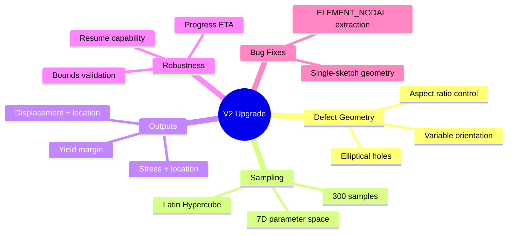
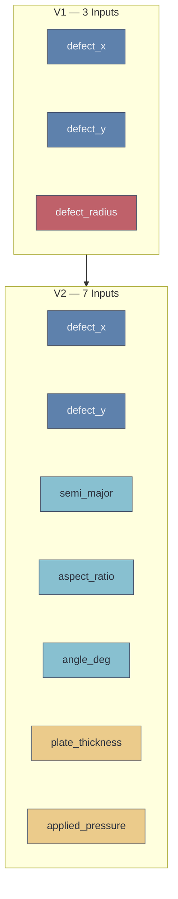
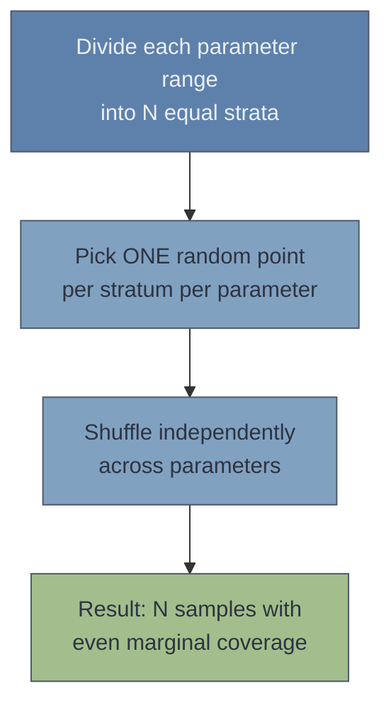
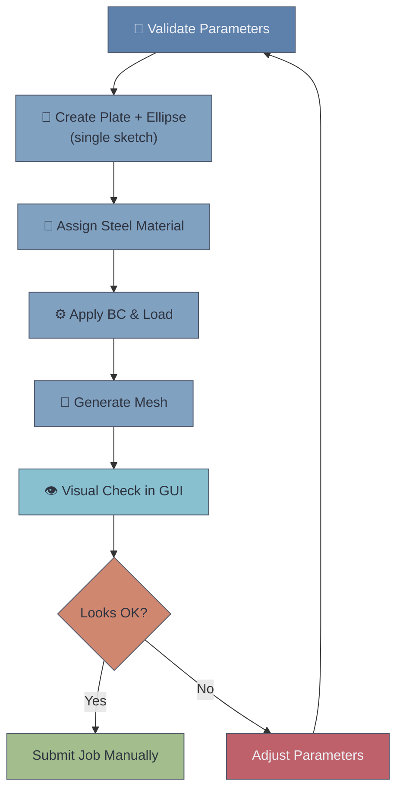
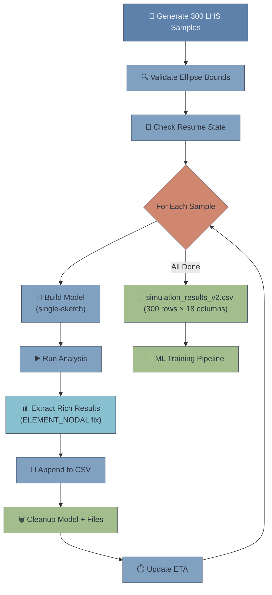

> [!info] Document Metadata
> **Purpose:** Complete documentation of the V1 → V2 Abaqus simulation upgrade  
> **Scripts:** `test_single_model_v2.py`, `run_batch_simulations_v2.py`  
> **Dataset:** `simulation_results_v2.csv` — 300 rows × 18 columns  
> **Location:** `C:\temp\RP3\V2_Elliptical_Defects\`  
> **Created:** 6 February 2026  
> **Related:** V1 test script, V1 batch script

---

## Overview



The V2 upgrade transforms the Abaqus simulation pipeline from a simple circular-hole parametric sweep into a comprehensive elliptical-defect study with richer inputs, richer outputs, and smarter sampling. This document covers **what changed, why, how it works, and the validated results**.

> [!success] Key Achievement
> The V2 pipeline generated **300 validated simulations** across a **7-dimensional input space**, producing a dataset with **18 columns** of structured data ready for ML surrogate model training. All stress and displacement locations are correctly extracted and physically sensible.

---

## V1 vs V2 Comparison

### At a Glance

| Feature | V1 (Circular Holes) | V2 (Elliptical Defects) | Change |
|---------|--------------------|-----------------------|--------|
| Defect shape | Circle | Ellipse (rotatable) | ⬆️ More general |
| Input parameters | 3 | 7 | +133% |
| Output columns | 2 | 10 | +400% |
| Total CSV columns | 6 | 18 | +200% |
| Sampling method | Uniform grid | Latin Hypercube | ⬆️ Better coverage |
| Number of simulations | 100 | 300 | +200% |
| Stress location | ❌ Not recorded | ✅ (x, y, z) coordinates | New |
| Displacement data | ❌ Not recorded | ✅ Magnitude + location | New |
| Yield margin | ❌ Binary only | ✅ Continuous ratio | New |
| Plate thickness | Fixed (2 mm) | Variable (1–4 mm) | ⬆️ Now an input |
| Applied pressure | Fixed (100 MPa) | Variable (50–200 MPa) | ⬆️ Now an input |
| Mesh size | 3 mm | 7 mm | Coarser (Learning Ed. limit) |
| Resume on crash | ❌ No | ✅ Yes | New |
| Progress ETA | ❌ No | ✅ Yes | New |
| Bounds validation | ❌ No | ✅ Rotated bounding box | New |

### Input Parameters



> [!note] Colour Key
> - 🔴 **Red:** V1 parameter replaced (radius → semi_major + aspect_ratio + angle)
> - 🟢 **Teal:** New shape parameters unique to V2
> - 🟡 **Yellow:** Previously-fixed constants now variable in V2

### Output Columns

| # | V1 Output | V2 Output | Notes |
|---|-----------|-----------|-------|
| 1 | `max_mises` | `max_mises` | Same — peak von Mises stress |
| 2 | `failed` | `max_mises_x` | **New** — x-coordinate of peak stress |
| 3 | — | `max_mises_y` | **New** — y-coordinate of peak stress |
| 4 | — | `max_mises_z` | **New** — z-coordinate (always 0.0 for plate surface) |
| 5 | — | `max_disp` | **New** — peak displacement magnitude |
| 6 | — | `max_disp_x` | **New** — x-coordinate of peak displacement |
| 7 | — | `max_disp_y` | **New** — y-coordinate of peak displacement |
| 8 | — | `max_disp_z` | **New** — z-coordinate of peak displacement |
| 9 | — | `yield_margin` | **New** — continuous ratio $\sigma_{VM}^{max} / \sigma_Y$ |
| 10 | — | `failed` | Same — binary flag, but now derived from yield_margin |

### Failure Classification

**V1 (binary only):**

$$\text{failed} = \begin{cases} 1 & \text{if } \sigma_{VM}^{max} > 250 \text{ MPa} \\ 0 & \text{otherwise} \end{cases}$$

**V2 (continuous + binary):**

$$\text{yield\_margin} = \frac{\sigma_{VM}^{max}}{\sigma_Y} = \frac{\sigma_{VM}^{max}}{250}$$

$$\text{failed} = \begin{cases} 1 & \text{if yield\_margin} \geq 1.0 \\ 0 & \text{otherwise} \end{cases}$$

> [!tip] Why Yield Margin Matters
> The continuous `yield_margin` gives the ML model a much richer regression target than a binary flag. A value of 0.95 (nearly failed) and 0.30 (very safe) both map to `failed = 0` in V1 — but V2 preserves this distinction. The model can learn *how close* to failure each configuration is.

---

## Sampling: Grid vs Latin Hypercube

### V1 — Uniform Grid

$$\text{Total} = N_x \times N_y \times N_r = 5 \times 5 \times 4 = 100$$

The grid places samples at fixed intervals. In 3D this is manageable, but scaling to 7D:

$$5^7 = 78{,}125 \text{ simulations (completely impractical)}$$

### V2 — Latin Hypercube Sampling (LHS)



LHS ensures that when you project the samples onto any single parameter axis, they are evenly spread — no clumping, no gaps. With 300 samples across 7 dimensions, this gives far better coverage than any affordable grid.

> [!note] Implementation Detail
> LHS was implemented from scratch in pure Python (no scipy/numpy dependency) because the Abaqus Python environment is limited. The implementation divides each range into $N$ equal strata, picks one random uniform point per stratum, then shuffles each parameter column independently to destroy inter-parameter correlations. Seed = 42 for full reproducibility.

```python
# Core LHS logic (simplified)
for i in range(n_samples):
    stratum_lo = lo + (hi - lo) * i / n_samples
    stratum_hi = lo + (hi - lo) * (i + 1) / n_samples
    samples.append(random.uniform(stratum_lo, stratum_hi))
random.shuffle(samples)  # destroy correlation
```

---

## Parameter Space

### V2 Parameter Ranges

| Parameter | Symbol | Min | Max | Units | Purpose |
|-----------|--------|-----|-----|-------|---------|
| `defect_x` | $c_x$ | 20 | 80 | mm | Ellipse centre x-position |
| `defect_y` | $c_y$ | 12 | 38 | mm | Ellipse centre y-position |
| `semi_major` | $a$ | 3 | 10 | mm | Ellipse semi-major axis |
| `aspect_ratio` | $a_r$ | 0.3 | 1.0 | — | $b/a$ ratio (0.3 = thin slit, 1.0 = circle) |
| `angle_deg` | $\theta$ | 0 | 180 | ° | Ellipse orientation angle |
| `plate_thickness` | $t$ | 1 | 4 | mm | Plate through-thickness |
| `applied_pressure` | $p$ | 50 | 200 | MPa | Tensile pressure on right edge |

> [!abstract] Derived Quantity
> The semi-minor axis is computed from the semi-major axis and aspect ratio:
> $$b = a \times a_r$$
> For example: $a = 8$ mm, $a_r = 0.5$ → $b = 4$ mm

### Fixed Parameters (Same as V1)

| Parameter | Value | Units |
|-----------|-------|-------|
| `PLATE_LENGTH` | 100.0 | mm |
| `PLATE_WIDTH` | 50.0 | mm |
| `YOUNGS_MODULUS` | 210,000 | MPa |
| `POISSONS_RATIO` | 0.3 | — |
| `YIELD_STRENGTH` | 250.0 | MPa |

---

## Geometry: From Circles to Ellipses

### Ellipse Parametric Equations

A rotated ellipse centred at $(c_x, c_y)$ with semi-major axis $a$, semi-minor axis $b$, rotated by angle $\theta$:

$$x(t) = c_x + a \cos(t) \cos(\theta) - b \sin(t) \sin(\theta)$$

$$y(t) = c_y + a \cos(t) \sin(\theta) + b \sin(t) \cos(\theta)$$

where $t \in [0, 2\pi)$ traces the full ellipse boundary.

### Polygon Approximation

The ellipse is drawn as a **24-segment closed polygon** (one line every 15°). This is sufficient given the 7 mm mesh — finer polygon resolution would create geometry detail smaller than the elements can resolve.

### Rotated Ellipse Bounding Box Validation

Before each simulation, the script checks whether the rotated ellipse fits inside the plate with a 2 mm safety margin:

$$\Delta x = \sqrt{(a \cos\theta)^2 + (b \sin\theta)^2}$$

$$\Delta y = \sqrt{(a \sin\theta)^2 + (b \cos\theta)^2}$$

$$\text{Valid if: } c_x - \Delta x > 2 \;\;\text{AND}\;\; c_x + \Delta x < 98 \;\;\text{AND}\;\; c_y - \Delta y > 2 \;\;\text{AND}\;\; c_y + \Delta y < 48$$

> [!warning] Out-of-Bounds Samples
> Any LHS sample where the ellipse would clip a plate edge is **rejected** before simulation. This filtering happens pre-run, so no compute time is wasted on invalid geometries.

---

## Key Technical Discovery: Single-Sketch Approach

### The Problem

The V1 script used `CutExtrude` to cut circular holes from a solid plate. When adapting this for ellipses in V2, `CutExtrude` **failed repeatedly** in the Learning Edition — even with different sketch methods and settings.

### Three Iterations of Debugging

| Attempt | Method | Result |
|---------|--------|--------|
| 1 | `EllipseByCenterPerimeter` + `CutExtrude` | ❌ `Cut extrude feature failed` — native ellipse creates internal construction geometry that confuses CutExtrude |
| 2 | Closed polygon (36 line segments) + `CutExtrude` | ❌ Same error — `CutExtrude` itself is unreliable with non-native sketch geometry in Learning Edition |
| 3 | **Single-sketch approach (no CutExtrude)** | ✅ **Success** |

### The Solution

Draw **both** the plate rectangle **and** the ellipse polygon in **one sketch**, then extrude once. Abaqus automatically treats the inner closed profile as a through-hole:

```python
# Draw BOTH outlines in one sketch
sketch = model.ConstrainedSketch(name='plateSketch', sheetSize=200.0)
sketch.rectangle(point1=(0.0, 0.0), point2=(PLATE_LENGTH, PLATE_WIDTH))

# Draw ellipse as closed polygon in SAME sketch
for i in range(NUM_SEGMENTS):
    p1 = ellipse_points[i]
    p2 = ellipse_points[(i + 1) % NUM_SEGMENTS]
    sketch.Line(point1=p1, point2=p2)

# Single extrude — hole is automatic
part = model.Part(name='Plate', dimensionality=THREE_D, type=DEFORMABLE_BODY)
part.BaseSolidExtrude(sketch=sketch, depth=plate_thickness)
```

> [!tip] Why This Works
> This is actually how you'd do it manually in the Abaqus GUI — sketch a rectangle, sketch a shape inside it, extrude, and you get a plate with a hole. The `CutExtrude` approach (create solid, then cut) is a two-step workaround that's less reliable with non-circular profiles in the Learning Edition.

---

## Bug Fix: Stress Location Extraction (ELEMENT_NODAL)

### The Bug

After the first batch run, **all stress location columns were uniformly zero** (`max_mises_x = max_mises_y = max_mises_z = 0.0` for every row). Displacement locations were correct.

### Root Cause

| Field | Default Position | Has `nodeLabel`? | Location Extraction? |
|-------|-----------------|------------------|---------------------|
| Displacement (U) | `NODAL` | ✅ Yes | ✅ Worked |
| Stress (S) | `INTEGRATION_POINT` | ❌ No | ❌ All zeros |
| Stress (S) with `ELEMENT_NODAL` | `ELEMENT_NODAL` | ✅ Yes | ✅ Fixed |

Von Mises stress is computed at **integration points** (Gauss points inside elements), which do **not** have a `nodeLabel` attribute. The script was trying to read `.nodeLabel` from these values — the attribute access silently returned zero instead of raising an error.

### The Fix

Request the stress field extrapolated to element nodes using `ELEMENT_NODAL` position:

```python
# BEFORE (broken) — integration points have no nodeLabel
stress_field = frame.fieldOutputs['S']
for val in stress_field.values:
    node_label = val.nodeLabel  # ← always 0 for integration points!

# AFTER (fixed) — ELEMENT_NODAL extrapolates stress to nodes
stress_at_nodes = frame.fieldOutputs['S'].getSubset(position=ELEMENT_NODAL)
for val in stress_at_nodes.values:
    node_label = val.nodeLabel  # ← now valid
    node = odb.rootAssembly.instances['PLATEINSTANCE'].nodes[node_label - 1]
    coords = node.coordinates  # ← real (x, y, z) position
```

> [!danger] Common Abaqus Scripting Pitfall
> This is a subtle but fundamental distinction: **stress lives at integration points, displacement lives at nodes**. The `ELEMENT_NODAL` position tells Abaqus to extrapolate integration-point values to the element nodes using shape functions, giving each stress value an associated node with real spatial coordinates.

---

## Script Architecture

### `test_single_model_v2.py` — GUI Verification



Run with: `abaqus cae script=test_single_model_v2.py`

**Default test configuration:** centre = (50, 25), semi-major = 6 mm, aspect ratio = 0.5, angle = 45°, thickness = 2 mm, pressure = 100 MPa

### `run_batch_simulations_v2.py` — Headless Batch



Run with: `abaqus cae noGUI=run_batch_simulations_v2.py`

### Robustness Features

| Feature | How It Works |
|---------|-------------|
| **Bounds validation** | Pre-filters LHS samples where the rotated ellipse bounding box clips the plate edge |
| **Resume capability** | On startup, reads existing CSV and skips already-completed `sim_id`s — safe to restart after crash |
| **Progress ETA** | Tracks average time per simulation and estimates remaining wall-clock time |
| **Error logging** | Failed simulations write `ERROR` to CSV with input params preserved, rather than crashing the batch |
| **Memory cleanup** | Deletes model + temporary files + `gc.collect()` after each simulation |

---

## Validated Dataset: `simulation_results_v2.csv`

### Dataset Summary

| Property | Value |
|----------|-------|
| **File** | `C:\temp\RP3\V2_Elliptical_Defects\simulation_results_v2.csv` |
| **File size** | 72 KB |
| **Rows** | 300 (all valid, no NaN, no ERROR rows) |
| **Columns** | 18 |
| **Generated** | 6 February 2026 |

### All 18 Columns

| # | Column | Type | Role | Range | Description |
|---|--------|------|------|-------|-------------|
| 1 | `sim_id` | int | ID | 1–300 | Simulation identifier |
| 2 | `defect_x` | float | Input | 20–80 mm | Ellipse centre x |
| 3 | `defect_y` | float | Input | 12–38 mm | Ellipse centre y |
| 4 | `semi_major` | float | Input | 3–10 mm | Semi-major axis |
| 5 | `aspect_ratio` | float | Input | 0.3–1.0 | $b/a$ ratio |
| 6 | `angle_deg` | float | Input | 0–180° | Orientation angle |
| 7 | `plate_thickness` | float | Input | 1–4 mm | Plate thickness |
| 8 | `applied_pressure` | float | Input | 50–200 MPa | Applied pressure |
| 9 | `max_mises` | float | Output | ~80–1100 MPa | Peak von Mises stress |
| 10 | `max_mises_x` | float | Output | varies | x-coord of peak stress |
| 11 | `max_mises_y` | float | Output | varies | y-coord of peak stress |
| 12 | `max_mises_z` | float | Output | 0.0 | z-coord (plate surface) |
| 13 | `max_disp` | float | Output | ~0.02–0.15 mm | Peak displacement |
| 14 | `max_disp_x` | float | Output | varies | x-coord of peak disp |
| 15 | `max_disp_y` | float | Output | varies | y-coord of peak disp |
| 16 | `max_disp_z` | float | Output | varies | z-coord of peak disp |
| 17 | `yield_margin` | float | Output | ~0.32–4.40 | $\sigma_{max}/\sigma_Y$ |
| 18 | `failed` | int | Output | 0 or 1 | 1 if yield_margin ≥ 1.0 |

### Validation Checks Passed

> [!success] All 300 Rows Validated
> - ✅ All 18 columns populated with full float precision
> - ✅ No uniformly zero columns (ELEMENT_NODAL fix confirmed)
> - ✅ No missing data or NaN values
> - ✅ Stress locations are near defect boundaries (physically correct)
> - ✅ `max_mises_z = 0.0` everywhere (correct for plate surface reference plane)
> - ✅ Displacement locations show expected boundary patterns ($x = 100$ at loaded edge)
> - ✅ `failed` flag correctly derived from `yield_margin` threshold
> - ✅ Data ranges are physically sensible

### Sample Rows

**Row 1:** Defect at (30.24, 12.52) → peak stress **270 MPa** at (30.71, 9.82) — near defect boundary ✓  
**Row 2:** Defect at (65.63, 15.41) → peak stress **510 MPa** at (66.39, 6.84) — near defect boundary ✓  
**Row 3:** Defect at (58.89, 34.18) → peak stress **302 MPa** at (59.00, 30.97) — near defect boundary ✓

---

## Mesh Trade-off: 3 mm → 7 mm

| Property | V1 (3 mm) | V2 (7 mm) | Impact |
|----------|-----------|-----------|--------|
| Typical node count | ~370 | ~650 | Both under Learning Edition ~1000 limit |
| Stress accuracy | 21–48% underestimation | Greater underestimation (coarser) | Quantitative accuracy reduced |
| Qualitative trends | ✅ Correct | ✅ Correct | Both capture the right *shape* of stress response |
| ML suitability | ✅ Good | ✅ Good | Surrogate learns trends, not absolute values |

> [!note] Why 7 mm?
> The V2 models have more complex geometry (elliptical holes with variable thickness) which can produce more nodes than V1's circular holes. The 7 mm element size was chosen to keep even the most complex V2 configurations comfortably under the Learning Edition's ~1000 node limit. With 24-segment ellipse polygons at 3 mm mesh, some configurations hit 2600+ nodes — well over the limit.

---

## Source Files

All V2 scripts and the validated dataset are archived in attachments:

| File | Description |
|------|-------------|
| [[test_single_model_v2.py]] | GUI verification script — elliptical defect, single-sketch approach, 7 mm mesh |
| [[run_batch_simulations_v2.py]] | Headless batch script — 300 LHS samples, 7 inputs, 10 outputs, resume capability, ELEMENT_NODAL fix |
| [[simulation_results_v2.csv]] | Validated dataset — 300 rows × 18 columns |

> [!tip] Working Directory
> The live copies used by Abaqus are at `C:\temp\RP3\V2_Elliptical_Defects\`. The attachments above are archived copies for reference alongside this documentation.

### Run Commands

**GUI test (visual verification):**
```bash
abaqus cae script=test_single_model_v2.py
```

**Headless batch (data generation):**
```bash
abaqus cae noGUI=run_batch_simulations_v2.py
```

> [!danger] Critical Requirements
> 1. Run from `C:\temp\RP3\V2_Elliptical_Defects\` directory
> 2. Ensure `test_single_model_v2.py` works first
> 3. Allow ~10–15 minutes for 300 simulations at 7 mm mesh
> 4. Do **not** run with standard Python — must use `abaqus cae`

---

## Project Folder Structure

```
C:\temp\RP3\
├── V1_Circular_Holes\
│   ├── test_single_model.py          ← V1 GUI script
│   ├── run_batch_simulations.py      ← V1 batch script
│   └── simulation_results.csv        ← 100 rows × 6 columns
│
└── V2_Elliptical_Defects\
    ├── test_single_model_v2.py       ← V2 GUI script
    ├── run_batch_simulations_v2.py   ← V2 batch script (with ELEMENT_NODAL fix)
    ├── simulation_results_v2.csv     ← 300 rows × 18 columns ✅
    ├── Job_0001.inp … Job_0300.inp   ← Individual Abaqus input files
    ├── TestJob_V2.*                  ← Test run output files
    └── Test Run Success for 06.02.2026.cae
```

---

## Current Status

| Item | Status |
|------|--------|
| V2 test script (`test_single_model_v2.py`) | ✅ Complete |
| V2 batch script (`run_batch_simulations_v2.py`) | ✅ Complete |
| CutExtrude debugging → single-sketch approach | ✅ Resolved |
| ELEMENT_NODAL stress extraction bug fix | ✅ Resolved |
| V2 batch run (300 simulations) | ✅ Complete |
| Full CSV validation (all 300 rows) | ✅ Complete |
| Project folder reorganisation (V1/V2) | ✅ Complete |
| ML pipeline update for V2 format | ⬜ Pending |

---

## Next Steps

> [!question] What's Next?

1. **Update ML pipeline** — `rp3_train_on_abaqus_data.py` needs modification to consume 18-column V2 CSV (7 inputs instead of 3, multiple output targets)
2. **Train surrogate models** on the 300-sample V2 dataset
3. **University license batch** — optionally re-run with finer mesh (3 mm or smaller) on the Professional Edition for accuracy comparison

---

## Related Documents

- V1 test script (see [[V1 — Circular Holes & Initial Pipeline]]) — V1 GUI verification script
- V1 batch script (see [[V1 — Circular Holes & Initial Pipeline]]) — V1 batch processing script
- [[V1 — Circular Holes & Initial Pipeline#Analytical Validation — Kirsch & Heywood|Analytical Validation (Kirsch & Heywood)]] — FEA accuracy analysis
- [[V1 ML Results — Circular Holes & 3 Inputs]] — ML pipeline (to be updated for V2)

### Session Logs

- [V2 Scripts Session]] — Built both V2 scripts, debugged CutExtrude
- [V2 Batch Run Session]] — Bug fix, 300 simulations, full validation

---

*Document created: 6 February 2026*  
*For: AENG30017 Research Project 3*

#abaqus #python #FEA #elliptical-defects #V2 #LHS #batch-processing #RP3 #data-generation #ELEMENT-NODAL
