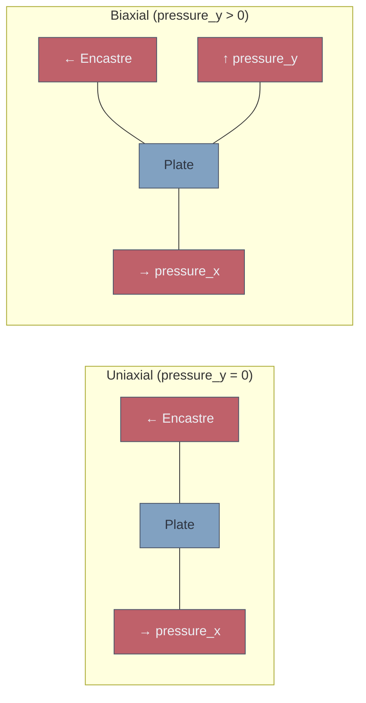
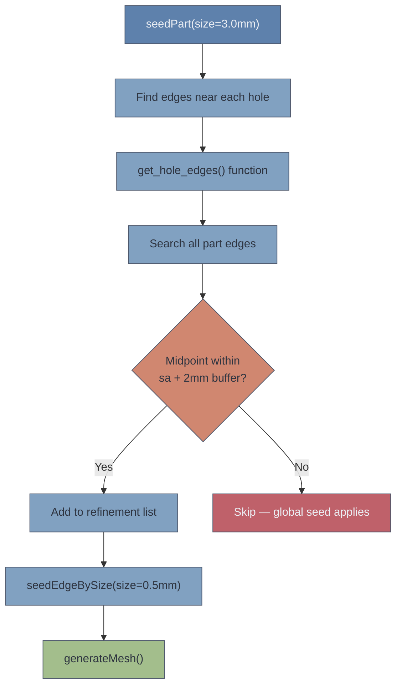

> [!info] Document Metadata
> **Purpose:** V3 Abaqus simulation upgrade — two-hole interaction with biaxial loading and local mesh refinement
> **Scripts:** `test_single_model_v3.py`, `run_batch_simulations_v3.py`
> **Dataset:** `simulation_results_v3.csv` — 500 rows × 28 columns
> **Status:** ✅ Complete — 500 samples generated
> **Created:** 9 February 2026 (documented 10 February 2026)
> **Related:** [[V2 — Elliptical Defects & Enhanced Pipeline]], [[V4 — Composite N-Defect Plates]]

---

## Overview

V3 studies the **interaction between two elliptical holes** — the regime where Kirsch and Heywood analytical solutions break down. When holes are far apart, each behaves independently. When close together, their stress fields interact in complex ways that only FEA (or a trained surrogate) can predict.

## V3 — Two-Hole Interaction

### What's New in V3

1. **Two elliptical holes per plate** — each with independent position, size, shape, and orientation
2. **Biaxial loading** — pressure on right face (always) and optionally top face
3. **Local mesh refinement** — 0.5 mm at hole edges, 3 mm global (requires full licence)
4. **Ligament stress extraction** — maximum stress in the region between the two holes
5. **Inter-hole distance** — derived geometric feature computed from hole centres

### V3 Parameter Space

| # | Parameter | Range | Units | Notes |
|---|-----------|-------|-------|-------|
| 1 | `hole1_x` | 15–45 | mm | Left half of plate |
| 2 | `hole1_y` | 12–38 | mm | |
| 3 | `hole1_semi_major` | 3–8 | mm | |
| 4 | `hole1_aspect_ratio` | 0.3–1.0 | — | 1.0 = circle |
| 5 | `hole1_angle` | 0–180 | ° | |
| 6 | `hole2_x` | 55–85 | mm | Right half of plate |
| 7 | `hole2_y` | 12–38 | mm | |
| 8 | `hole2_semi_major` | 3–8 | mm | |
| 9 | `hole2_aspect_ratio` | 0.3–1.0 | — | |
| 10 | `hole2_angle` | 0–180 | ° | |
| 11 | `plate_thickness` | 1–4 | mm | |
| 12 | `pressure_x` | 50–200 | MPa | Right face (always applied) |
| 13 | `pressure_y` | 0–100 | MPa | Top face (0 = uniaxial mode) |

> [!note] Hole Placement Strategy
> Hole 1 is constrained to the left half (x: 15–45) and Hole 2 to the right half (x: 55–85). This reduces the probability of overlap while still allowing variable inter-hole distances. A conservative overlap check ensures centre distance exceeds the sum of semi-major axes plus a 2 mm margin.

### V3 CSV Structure (28 columns)

| Column Group | Columns | Count |
|-------------|---------|-------|
| Identifier | sim_id | 1 |
| Inputs | hole1_x through pressure_y | 13 |
| Derived geometry | inter_hole_dist | 1 |
| Global stress | max_mises, max_mises_x/y/z | 4 |
| Per-hole stress | max_mises_hole1, max_mises_hole2 | 2 |
| Interaction stress | ligament_stress | 1 |
| Displacement | max_disp, max_disp_x/y/z | 4 |
| Failure | yield_margin, failed | 2 |
| **Total** | | **28** |

### Biaxial Loading



When `pressure_y = 0`, V3 behaves like V2 with two holes (uniaxial tension). When `pressure_y > 0`, a second Pressure load is applied to the top face ($y = W$), creating a biaxial stress state that fundamentally changes the stress distribution around the holes.

> [!warning] Why Biaxial Matters
> Under uniaxial loading, the Kirsch SCF is 3 at $\theta = 90°$. Under equibiaxial loading ($\sigma_x = \sigma_y$), the SCF drops to 2 but is uniform around the entire hole circumference. The ML model must learn this load-dependent behaviour — something that varies smoothly between these two limits as `pressure_y` increases.

### Ligament Stress Extraction

The **ligament** is the material between the two holes. When holes are close, this region experiences elevated stress from the superposition of both holes' stress fields.

The script extracts the maximum von Mises stress within the rectangular region:
- x between `hole1_x + sa1` and `hole2_x - sa2` (between the hole edges)
- y within a band around the midpoint of the two hole centres

This `ligament_stress` value is the key metric for hole interaction effects:
- When holes are far apart: `ligament_stress ≈ max_mises_hole1` or `max_mises_hole2` (independent behaviour)
- When holes are close: `ligament_stress >> max_mises_hole1` and `max_mises_hole2` (interaction amplification)

### Local Mesh Refinement



The `get_hole_edges()` function iterates over all edges of the part, checking whether each edge's midpoint falls within `semi_major + 2 mm buffer` of any hole centre. Matched edges receive a fine seed of 0.5 mm while the rest of the plate uses the 3 mm global seed.

> [!danger] This Requires the Full Licence
> A 0.5 mm local mesh with 3 mm global mesh will produce thousands of nodes — far beyond the Learning Edition's ~1000 node limit. This is the primary reason V3/V4 were designed for university computers.

---

## Run Commands

**GUI test (visual verification):**
```bash
cd C:\temp\RP3\V3_Two_Holes\
abaqus cae script=test_single_model_v3.py
```

**Headless batch (data generation):**
```bash
abaqus cae noGUI=run_batch_simulations_v3.py
```

> [!danger] Critical Requirements
> Must run on university computers with **full Abaqus Professional licence**. Copy scripts from Obsidian vault to `C:\temp\RP3\V3_Two_Holes\`. Run test script first — visually verify geometry, mesh, loads before committing to batch. V3 batch: expect ~30—60 minutes.

## What to Check in GUI

- [x] Both holes visible with correct shapes and orientations
- [x] Mesh visibly finer around both holes
- [x] Encastre on left face, pressure on right face
- [x] If pressure_y > 0: second pressure on top face
- [x] Stress concentration visible at hole edges and in the ligament

## Patterns from V2

All V3 scripts maintain the proven patterns documented in [[V2 — Elliptical Defects & Enhanced Pipeline]]: single-sketch geometry, ELEMENT_NODAL extraction, rotated bounding box validation, resume capability, memory cleanup, pure-Python LHS, and progress ETA.

### New Patterns in V3

| Pattern | Purpose | Details |
|---------|---------|---------|
| `get_hole_edges()` | Local mesh refinement | Searches all part edges, seeds those near hole centres |
| Pairwise collision | Overlap prevention | O(n²) distance check for all hole pairs |
| Ligament extraction | Interaction stress | Rectangular region search between holes |

---

## Status

| Item | Status |
|------|--------|
| V3 test script | ✅ Written, in `attachments/Scripts/` |
| V3 batch script | ✅ Written, in `attachments/Scripts/` |
| V3 batch run (500 sims) | ✅ Complete — CSV in `03_Abaqus/` (196 KB, 28 columns) |
| V3 ML pipeline | ⬜ Not yet created |

---

## Source Files

| File | Description |
|------|-------------|
| [[test_single_model_v3.py]] | V3 GUI verification — two holes, biaxial, local mesh |
| [[run_batch_simulations_v3.py]] | V3 headless batch — 500 LHS samples |

---

## Related Documents

- [[V1 — Circular Holes & Initial Pipeline]] — V1 foundation
- [[V2 — Elliptical Defects & Enhanced Pipeline]] — V2 (single ellipse, patterns V3 builds on)
- [[V4 — Composite N-Defect Plates]] — V4 (composite extension)
- [[V5 — Jagged Crack Geometry & 5000 Samples]] — V5 (crack geometry)

### Session Logs

- [V3 & V4 Scripting Session]]

---

*Document created: 10 February 2026*
*For: AENG30017 Research Project 3*

#abaqus #V3 #multi-hole #biaxial #local-mesh #RP3
