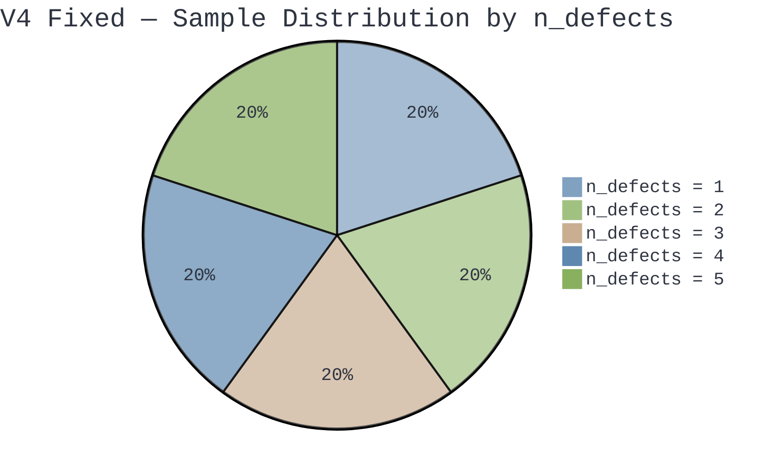

> [!info] Document Metadata
> **Purpose:** V4 Abaqus simulation — CFRP composite plates with 1—5 elliptical defects, Tsai-Wu + Hashin failure criteria
> **Scripts:** `test_single_model_v4.py`, `run_batch_simulations_v4_composite_FIXED.py`
> **Dataset:** `simulation_results_v4_500samples_POST_FIXES_FINAL.csv` — 500 rows × 53 columns
> **Status:** ✅ Complete — 500 validated samples (post-fixes)
> **Created:** 9 February 2026 (documented 10 February 2026, updated 17 February 2026)
> **Related:** [[V3 — Two-Hole Interaction & Biaxial Loading]], [[V5 — Jagged Crack Geometry & 5000 Samples]]

---

## Overview

V4 is a **composite material** implementation. Unlike V1—V3 which use isotropic steel, V4 uses CFRP with a [0/45/—45/90]s layup. This changes the material model, failure criteria, and output extraction fundamentally. No analytical solution exists for multi-defect composite plates — the ML surrogate framework is the only tractable approach.

## V4 — Composite N-Defect Plates

> [!important] V4 is a Composite Implementation
> Unlike V1–V3 which use isotropic steel, V4 uses **CFRP composite** with a [0/45/−45/90]s layup. This changes the material model, failure criteria, and output extraction fundamentally. The naming convention also shifts from "holes" to "defects" throughout.

### What's New in V4

1. **Composite material** — CFRP with engineering constants (9 independent elastic properties) and [0/45/−45/90]s symmetric layup
2. **Dual failure criteria** — Tsai-Wu (single index) and Hashin (4 damage modes: fibre tension/compression, matrix tension/compression)
3. **Variable number of defects** — 1 to 5 per plate, controlled by `n_defects` parameter
4. **Fixed-width CSV** — always MAX_DEFECTS=5 sets of columns; unused defects are zero-padded
5. **Stratified sampling** — 50 samples per defect count, 250 total
6. **Per-defect stress extraction** — `max_mises_defect1` through `max_mises_defect5`
7. **Composite-specific outputs** — `tsai_wu_index`, `max_hashin_ft/fc/mt/mc`, directional stresses `max_s11/s22/s12`

### Composite Material Definition

The CFRP material uses 9 engineering constants:

| Property | Value | Description |
|----------|-------|-------------|
| E1 | 140 GPa | Fibre-direction modulus |
| E2 = E3 | 10 GPa | Transverse modulus |
| G12 = G13 | 5 GPa | In-plane shear modulus |
| G23 | 3.5 GPa | Out-of-plane shear modulus |
| ν12 = ν13 | 0.3 | Major Poisson's ratio |
| ν23 | 0.4 | Transverse Poisson's ratio |

Failure strengths for Tsai-Wu and Hashin:

| Strength | Value | Description |
|----------|-------|-------------|
| Xt | 1500 MPa | Fibre tensile strength |
| Xc | 1200 MPa | Fibre compressive strength |
| Yt | 50 MPa | Matrix tensile strength |
| Yc | 200 MPa | Matrix compressive strength |
| S12 | 70 MPa | In-plane shear strength |

### The Variable-Input Problem

This is fundamentally harder than V3 because the input space changes dimension per simulation:

| n_defects | Active inputs | Unused inputs (set to 0) |
|---------|--------------|--------------------------|
| 1 | 10 (5 global + 5 defect params) | 20 (defects 2–5) |
| 2 | 15 | 15 (defects 3–5) |
| 3 | 20 | 10 (defects 4–5) |
| 4 | 25 | 5 (defect 5) |
| 5 | 30 | 0 |

> [!tip] How the ML Model Handles This
> The `n_defects` feature tells the model how many defects are real. Unused defect columns being 0 is a natural encoding — when all parameters of a defect are zero, the model learns that defect doesn't exist. Tree-based models handle this naturally via feature splitting. Neural networks need to learn the conditional relationship between `n_defects` and which feature groups are active.

### V4 CSV Structure (53 columns)

| Column Group | Columns | Count |
|-------------|---------|-------|
| Identifier | sim_id | 1 |
| Defect count | n_defects | 1 |
| Defect 1–5 params | defect1_x, defect1_y, defect1_semi_major, defect1_aspect_ratio, defect1_angle (×5) | 25 |
| Loading | pressure_x, pressure_y | 2 |
| Layup params | ply_thickness, layup_rotation | 2 |
| Derived geometry | total_thickness, min_inter_defect_dist | 2 |
| Global stress | max_mises, max_s11, min_s11, max_s22, min_s22, max_s12 | 6 |
| Composite failure | tsai_wu_index, max_hashin_ft, max_hashin_fc, max_hashin_mt, max_hashin_mc | 5 |
| Per-defect stress | max_mises_defect1 through max_mises_defect5 | 5 |
| Displacement | max_disp | 1 |
| Element count | n_elements | 1 |
| Failure flags | failed_tsai_wu, failed_hashin | 2 |
| **Total** | | **53** |

> [!note] Column Naming Convention
> V4 uses `defect1_x` (no underscore between "defect" and number), and per-defect stress columns are `max_mises_defect1` (not `defect_1_max_mises`). The ML pipeline's auto-detection handles this correctly.

### Stratified n_defects Sampling

The original 250 samples were divided into 50 per defect count. The fixed script scaled this to 500 samples (100 per defect count):



This ensures the ML model sees enough examples of every defect count. Without stratification, LHS would produce a random distribution heavily biased toward the middle values.

### Collision Detection

With defects placed anywhere on the plate, pairwise overlap checking is essential:

```python
# For all pairs of active defects
for i in range(n_defects):
    for j in range(i+1, n_defects):
        dist = sqrt((cx_i - cx_j)**2 + (cy_i - cy_j)**2)
        min_dist = sa_i + sa_j + 2.0  # margin
        if dist < min_dist:
            reject_sample()
```

This is $O(n^2)$ but with $n \leq 5$ it's trivial — at most 10 pair checks per sample.

---

---

## Run Commands

**GUI test:**
```bash
cd C:\temp\RP3\V4_N_Holes\
abaqus cae script=test_single_model_v4.py
```

**Headless batch:**
```bash
abaqus cae noGUI=run_batch_simulations_v4_composite.py
```

> [!danger] Critical Requirements
> Must run on university computers with **full Abaqus Professional licence**. Copy scripts from Obsidian vault (`attachments/Scripts/`) to `C:\temp\RP3\V4_N_Holes\`. Run test script first. V4 batch: expect ~45—90 minutes (variable node count; 5-defect composite models will be slowest).

---

## What to Check in GUI

- [x] All N defects visible (tested with N=3)
- [x] No defects overlapping each other or plate edges
- [x] Mesh refined around every defect
- [x] Composite layup applied correctly
- [x] Tsai-Wu and Hashin outputs extracted
- [x] Model solves without errors

---

## Patterns from V2

All V4 scripts maintain the proven patterns documented in [[V2 — Elliptical Defects & Enhanced Pipeline]]: single-sketch geometry, ELEMENT_NODAL extraction, rotated bounding box validation, resume capability, memory cleanup, pure-Python LHS, and progress ETA.

### New Patterns in V4

| Pattern | Purpose | Details |
|---------|---------|---------|
| Stratified sampling | Balanced n_defects | Equal samples per defect count |
| Fixed-width CSV | Variable inputs — fixed format | MAX_DEFECTS=5 columns, unused = 0 |
| Composite layup | CFRP material | [0/45/—45/90]s with engineering constants |
| Dual failure criteria | Tsai-Wu + Hashin | Multi-output regression + classification |
| Directional stress extraction | Composite stress state | S11, S22, S12 components |
| Per-defect stress extraction | Spatial attribution | `max_mises_defect1` through `max_mises_defect5` |

---

## V4 Data Validation & Fixes (14 February 2026)

> [!danger] V4 Original Data Had Three Critical Problems
> Post-run analysis of `simulation_results_v4.csv` (250 rows × 53 columns) revealed three issues that compromise the ML training data. All three are addressed in a corrected script: `run_batch_simulations_v4_composite_FIXED.py`.

### Problem 1: Uneven Defect Distribution

**Expected:** 50 samples per defect count (1–5), totalling 250.

**Actual:**

| n_defects | Expected | Actual | Loss |
|-----------|----------|--------|------|
| 1 | 50 | 100 | — |
| 2 | 50 | 75 | — |
| 3 | 50 | 49 | −1 |
| 4 | 50 | 17 | −33 |
| 5 | 50 | 9 | −41 |

**Root cause:** The original script generated all defect positions at once via LHS, then rejected entire samples if any pair of holes overlapped. With more holes, overlap probability increases dramatically — so most 4- and 5-hole configurations were rejected before the simulation even ran.

**Fix:** Sequential hole placement with retry. Each hole is placed one at a time. A new hole is only accepted if it (a) fits within the plate bounds and (b) does not overlap any already-placed hole. If it fails either check, a new random position is picked and tried again, up to 200 attempts per hole. This guarantees zero overlap crashes while still allowing holes to sit close together — important for studying stress interaction effects.

Additionally, a safety exit was added: if placement fails 50 consecutive times for a given defect count, the script prints a warning and moves on rather than looping forever.

### Problem 2: 93% Failure Rate

**Observed failure rates by defect count:**

| n_defects | Tsai-Wu fail % | Hashin fail % |
|-----------|---------------|---------------|
| 1 | 91% | 89% |
| 2 | 92% | 92% |
| 3 | 98% | 96% |
| 4 | 94% | 94% |
| 5 | 100% | 100% |
| **Overall** | **93.2%** | **92.0%** |

**Root cause:** The applied pressure range (50–200 MPa for `pressure_x`, 0–100 MPa for `pressure_y`) was far too high for a ~1 mm thick CFRP panel. For context, realistic in-service aerospace loads on thin composite skins (fuselage panels, control surfaces) are typically 1–15 MPa. The matrix tensile strength $Y_t$ is only 40–50 MPa, so 50+ MPa applied pressure virtually guarantees matrix-dominated failure.

**Consequence for ML:** Classification accuracy of 95% sounds impressive but is barely better than a model that always predicts "failed". The Random Forest confusion matrices confirmed this — RF achieved perfect recall by classifying every sample as failed (TN = 0).

**Fix:** Pressure range adjusted to 5–100 MPa for `pressure_x` and 0–100 MPa for `pressure_y`, calibrated through 30-simulation test batches to achieve a ~50% Tsai-Wu failure rate. The initial fix of 1–15 MPa proved too conservative (almost no failures), so the range was iteratively widened until the failure split stabilised around 50/50.

### Problem 3: Peak Stress at Boundary, Not at Defects

**Observed:** In 82 out of 250 cases (33%), the global `max_mises` exceeded the highest per-defect mises stress by more than 1 MPa. The worst case showed a gap of 2,458 MPa — meaning the peak stress was at the plate boundary, not at any hole.

**Breakdown by defect count:**

| n_defects | Affected / Total | % Affected |
|-----------|-----------------|------------|
| 1 | 48 / 100 | 48% |
| 2 | 21 / 75 | 28% |
| 3 | 10 / 49 | 20% |
| 4 | 2 / 17 | 12% |
| 5 | 1 / 9 | 11% |

Single-hole plates were worst affected. The top 10 worst cases all had `n_defects = 1` and low `layup_rotation` (0–25°), suggesting the encastre boundary condition created stress concentrations that dominated the defect-induced stress, particularly when the stiff fibre direction was aligned with the loading.

**Root cause:** The encastre (fully fixed) boundary condition on the left edge locks all translations AND rotations. For a shell model under in-plane loading, this creates an artificial bending constraint at the support that generates stresses unrelated to the defects.

**Consequence for ML:** The model was partly learning boundary condition effects rather than defect-driven failure physics — undermining the entire purpose of the surrogate model.

**Fix:** Changed the left edge from `EncastreBC` to `PinnedBC`. Pinned constrains translations ($U_1 = U_2 = U_3 = 0$) but leaves rotations free ($UR_1, UR_2, UR_3$ unconstrained). This removes the artificial rotational constraint and the associated stress concentration.

### Additional Fix: ODB Double-Open

The original script opened the ODB file, extracted stresses, closed it, then reopened it to extract displacements. The fixed script reads both from the same open session, eliminating one file open/close cycle per simulation (adds up over 500 runs).

---

### Overlap Detection: Conservative vs Exact Approach

During the fixes, the overlap check was reviewed. The current method compares centre-to-centre distance against the sum of semi-major axes plus a 2 mm margin:

$d(\text{centres}) < a_1 + a_2 + 2\text{ mm} \implies \text{reject}$

This is **conservative** — it treats every ellipse as if it were a circle with radius equal to the semi-major axis. Two thin cracks pointing away from each other would be rejected even if they are geometrically far apart.

#### The Exact Alternative: Characteristic Cubic Polynomial

An algebraically exact overlap test exists. The full derivation from ellipse parameters to the yes/no decision follows.

##### Step 1 — Standard Ellipse at the Origin

An axis-aligned ellipse centred at $(0, 0)$ with semi-major axis $a$ along $x$ and semi-minor axis $b$ along $y$:

$\frac{x^2}{a^2} + \frac{y^2}{b^2} = 1$

##### Step 2 — Rotate by Angle $\theta$

Replace $x, y$ with coordinates rotated by $\theta$:

$x \longrightarrow x\cos\theta + y\sin\theta \qquad y \longrightarrow -x\sin\theta + y\cos\theta$

Substituting into the ellipse equation:

$\frac{(x\cos\theta + y\sin\theta)^2}{a^2} + \frac{(-x\sin\theta + y\cos\theta)^2}{b^2} = 1$

Expanding each squared term:

$(x\cos\theta + y\sin\theta)^2 = x^2\cos^2\theta + 2xy\sin\theta\cos\theta + y^2\sin^2\theta$

$(-x\sin\theta + y\cos\theta)^2 = x^2\sin^2\theta - 2xy\sin\theta\cos\theta + y^2\cos^2\theta$

Dividing by $a^2$ and $b^2$ respectively and collecting terms:

$\underbrace{\left(\frac{\cos^2\theta}{a^2} + \frac{\sin^2\theta}{b^2}\right)}_{A} x^2 + \underbrace{2\sin\theta\cos\theta\left(\frac{1}{a^2} - \frac{1}{b^2}\right)}_{B} xy + \underbrace{\left(\frac{\sin^2\theta}{a^2} + \frac{\cos^2\theta}{b^2}\right)}_{C} y^2 = 1$

##### Step 3 — Translate to Centre $(c_x, c_y)$

Replace $x \to (x - c_x)$ and $y \to (y - c_y)$:

$A(x - c_x)^2 + B(x - c_x)(y - c_y) + C(y - c_y)^2 = 1$

Expanding each term:

$A(x - c_x)^2 = Ax^2 - 2Ac_x x + Ac_x^2$

$B(x - c_x)(y - c_y) = Bxy - Bc_y x - Bc_x y + Bc_x c_y$

$C(y - c_y)^2 = Cy^2 - 2Cc_y y + Cc_y^2$

Collecting all terms and moving $1$ to the left gives the general conic $Ax^2 + Bxy + Cy^2 + Dx + Ey + F = 0$ where:

$D = -2Ac_x - Bc_y$

$E = -Bc_x - 2Cc_y$

$F = Ac_x^2 + Bc_x c_y + Cc_y^2 - 1$

##### Step 4 — Matrix Representation

The conic equation can be written as $\mathbf{X}^\top \mathbf{M}\, \mathbf{X} = 0$ where $\mathbf{X} = (x,\; y,\; 1)^\top$ and $\mathbf{M}$ is the symmetric $3 \times 3$ matrix:

$\mathbf{M} = \begin{pmatrix} A & B/2 & D/2 \\ B/2 & C & E/2 \\ D/2 & E/2 & F \end{pmatrix}$

Each ellipse gives one such matrix. Call them $\mathbf{M}_1$ and $\mathbf{M}_2$.

##### Step 5 — The Characteristic Equation

Two ellipses are separate (no overlap) if and only if:

$\det\!\bigl(\lambda\,\mathbf{M}_1 + (1 - \lambda)\,\mathbf{M}_2\bigr) = 0$

has **all real roots** and **exactly two** of them lie in the open interval $(0, 1)$.

Rewrite as:

$\det\!\bigl(\mathbf{P} + \lambda\,\mathbf{Q}\bigr) = 0 \qquad \text{where} \quad \mathbf{P} = \mathbf{M}_2, \quad \mathbf{Q} = \mathbf{M}_1 - \mathbf{M}_2$

with entries $p_{ij} = (M_2)_{ij}$ and $q_{ij} = (M_1)_{ij} - (M_2)_{ij}$.

##### Step 6 — Expanding the $3 \times 3$ Determinant

The matrix $\mathbf{P} + \lambda\mathbf{Q}$ has entries $(p_{ij} + \lambda q_{ij})$. Cofactor expansion along the first row:

$\det = (p_{11}+\lambda q_{11})\,\mathcal{K}_1 - (p_{12}+\lambda q_{12})\,\mathcal{K}_2 + (p_{13}+\lambda q_{13})\,\mathcal{K}_3$

where each $\mathcal{K}$ is a $2 \times 2$ minor:

$\mathcal{K}_1 = (p_{22}+\lambda q_{22})(p_{33}+\lambda q_{33}) - (p_{23}+\lambda q_{23})(p_{32}+\lambda q_{32})$

$\mathcal{K}_2 = (p_{21}+\lambda q_{21})(p_{33}+\lambda q_{33}) - (p_{23}+\lambda q_{23})(p_{31}+\lambda q_{31})$

$\mathcal{K}_3 = (p_{21}+\lambda q_{21})(p_{32}+\lambda q_{32}) - (p_{22}+\lambda q_{22})(p_{31}+\lambda q_{31})$

Expanding each product — take $\mathcal{K}_1$ as the example:

$(p_{22}+\lambda q_{22})(p_{33}+\lambda q_{33}) = p_{22}p_{33} + \lambda(p_{22}q_{33} + q_{22}p_{33}) + \lambda^2 q_{22}q_{33}$

$(p_{23}+\lambda q_{23})(p_{32}+\lambda q_{32}) = p_{23}p_{32} + \lambda(p_{23}q_{32} + q_{23}p_{32}) + \lambda^2 q_{23}q_{32}$

Subtracting:

$\mathcal{K}_1 = \underbrace{(p_{22}p_{33} - p_{23}p_{32})}_{K_1^{(0)}} + \lambda\underbrace{(p_{22}q_{33} + q_{22}p_{33} - p_{23}q_{32} - q_{23}p_{32})}_{K_1^{(1)}} + \lambda^2\underbrace{(q_{22}q_{33} - q_{23}q_{32})}_{K_1^{(2)}}$

By identical expansion, $\mathcal{K}_2$ and $\mathcal{K}_3$ decompose the same way:

$K_2^{(0)} = p_{21}p_{33} - p_{23}p_{31}$
$K_2^{(1)} = p_{21}q_{33} + q_{21}p_{33} - p_{23}q_{31} - q_{23}p_{31}$
$K_2^{(2)} = q_{21}q_{33} - q_{23}q_{31}$

$K_3^{(0)} = p_{21}p_{32} - p_{22}p_{31}$
$K_3^{(1)} = p_{21}q_{32} + q_{21}p_{32} - p_{22}q_{31} - q_{22}p_{31}$
$K_3^{(2)} = q_{21}q_{32} - q_{22}q_{31}$

Multiplying each $\mathcal{K}_n$ by its first-row factor $(p_{1n} + \lambda q_{1n})$:

$(p_{11}+\lambda q_{11})(K_1^{(0)} + \lambda K_1^{(1)} + \lambda^2 K_1^{(2)}) = p_{11}K_1^{(0)} + \lambda(p_{11}K_1^{(1)} + q_{11}K_1^{(0)}) + \lambda^2(p_{11}K_1^{(2)} + q_{11}K_1^{(1)}) + \lambda^3 q_{11}K_1^{(2)}$

Same pattern for terms 2 and 3 (with appropriate signs).

##### Step 7 — Collecting the Cubic Coefficients

The determinant is a cubic in $\lambda$:

$\det(\mathbf{P} + \lambda\mathbf{Q}) = c_0 + c_1\lambda + c_2\lambda^2 + c_3\lambda^3$

Now substituting every $K_n^{(k)}$ expression back in and expanding fully:

**$c_0$ (constant term) $= \det(\mathbf{P})$:**

$c_0 = p_{11}(p_{22}p_{33} - p_{23}p_{32}) - p_{12}(p_{21}p_{33} - p_{23}p_{31}) + p_{13}(p_{21}p_{32} - p_{22}p_{31})$

Expanding into six products:

$c_0 = p_{11}p_{22}p_{33} - p_{11}p_{23}p_{32} - p_{12}p_{21}p_{33} + p_{12}p_{23}p_{31} + p_{13}p_{21}p_{32} - p_{13}p_{22}p_{31}$

**$c_1$ (coefficient of $\lambda$):**

$c_1 = p_{11}(p_{22}q_{33} + q_{22}p_{33} - p_{23}q_{32} - q_{23}p_{32})$
$+ \; q_{11}(p_{22}p_{33} - p_{23}p_{32})$
$- \; p_{12}(p_{21}q_{33} + q_{21}p_{33} - p_{23}q_{31} - q_{23}p_{31})$
$- \; q_{12}(p_{21}p_{33} - p_{23}p_{31})$
$+ \; p_{13}(p_{21}q_{32} + q_{21}p_{32} - p_{22}q_{31} - q_{22}p_{31})$
$+ \; q_{13}(p_{21}p_{32} - p_{22}p_{31})$

Expanding into 18 individual products:

$c_1 = p_{11}p_{22}q_{33} + p_{11}q_{22}p_{33} - p_{11}p_{23}q_{32} - p_{11}q_{23}p_{32}$
$+ \; q_{11}p_{22}p_{33} - q_{11}p_{23}p_{32}$
$- \; p_{12}p_{21}q_{33} - p_{12}q_{21}p_{33} + p_{12}p_{23}q_{31} + p_{12}q_{23}p_{31}$
$- \; q_{12}p_{21}p_{33} + q_{12}p_{23}p_{31}$
$+ \; p_{13}p_{21}q_{32} + p_{13}q_{21}p_{32} - p_{13}p_{22}q_{31} - p_{13}q_{22}p_{31}$
$+ \; q_{13}p_{21}p_{32} - q_{13}p_{22}p_{31}$

**$c_2$ (coefficient of $\lambda^2$):**

$c_2 = p_{11}(q_{22}q_{33} - q_{23}q_{32})$
$+ \; q_{11}(p_{22}q_{33} + q_{22}p_{33} - p_{23}q_{32} - q_{23}p_{32})$
$- \; p_{12}(q_{21}q_{33} - q_{23}q_{31})$
$- \; q_{12}(p_{21}q_{33} + q_{21}p_{33} - p_{23}q_{31} - q_{23}p_{31})$
$+ \; p_{13}(q_{21}q_{32} - q_{22}q_{31})$
$+ \; q_{13}(p_{21}q_{32} + q_{21}p_{32} - p_{22}q_{31} - q_{22}p_{31})$

Expanding into 18 individual products:

$c_2 = p_{11}q_{22}q_{33} - p_{11}q_{23}q_{32}$
$+ \; q_{11}p_{22}q_{33} + q_{11}q_{22}p_{33} - q_{11}p_{23}q_{32} - q_{11}q_{23}p_{32}$
$- \; p_{12}q_{21}q_{33} + p_{12}q_{23}q_{31}$
$- \; q_{12}p_{21}q_{33} - q_{12}q_{21}p_{33} + q_{12}p_{23}q_{31} + q_{12}q_{23}p_{31}$
$+ \; p_{13}q_{21}q_{32} - p_{13}q_{22}q_{31}$
$+ \; q_{13}p_{21}q_{32} + q_{13}q_{21}p_{32} - q_{13}p_{22}q_{31} - q_{13}q_{22}p_{31}$

**$c_3$ (coefficient of $\lambda^3$) $= \det(\mathbf{Q})$:**

$c_3 = q_{11}(q_{22}q_{33} - q_{23}q_{32}) - q_{12}(q_{21}q_{33} - q_{23}q_{31}) + q_{13}(q_{21}q_{32} - q_{22}q_{31})$

Expanding into six products:

$c_3 = q_{11}q_{22}q_{33} - q_{11}q_{23}q_{32} - q_{12}q_{21}q_{33} + q_{12}q_{23}q_{31} + q_{13}q_{21}q_{32} - q_{13}q_{22}q_{31}$

##### Step 8 — Solving the Cubic

We need the roots of:

$c_3\lambda^3 + c_2\lambda^2 + c_1\lambda + c_0 = 0$

Divide through by $c_3$ (assuming $c_3 \neq 0$) and substitute $\lambda = t - \dfrac{c_2}{3c_3}$ to obtain the depressed cubic:

$t^3 + pt + q = 0$

where:

$p = \frac{c_1}{c_3} - \frac{1}{3}\left(\frac{c_2}{c_3}\right)^{2} \qquad q = \frac{2}{27}\left(\frac{c_2}{c_3}\right)^{3} - \frac{c_2 c_1}{3c_3^2} + \frac{c_0}{c_3}$

The discriminant of the depressed cubic is:

$\Delta = -4p^3 - 27q^2$

**Case 1: $\Delta > 0$** — three distinct real roots. Use the trigonometric method:

$r = 2\sqrt{-\frac{p}{3}}, \qquad \varphi = \frac{1}{3}\arccos\!\left(\frac{3q}{pr}\right)$

$\lambda_1 = r\cos(\varphi) - \frac{c_2}{3c_3}$

$\lambda_2 = r\cos\!\left(\varphi - \frac{2\pi}{3}\right) - \frac{c_2}{3c_3}$

$\lambda_3 = r\cos\!\left(\varphi - \frac{4\pi}{3}\right) - \frac{c_2}{3c_3}$

**Case 2: $\Delta \leq 0$** — at least one complex root. The ellipses necessarily overlap (skip to Step 9).

##### Step 9 — Decision Rule

Count how many of $\lambda_1, \lambda_2, \lambda_3$ lie strictly inside the interval $(0, 1)$.

> [!success] Separation Test
> **Exactly two roots in $(0, 1)$** → ellipses are **separate**, no overlap.
>
> **Any other outcome** → ellipses **overlap** (or one contains the other).

*References:*
- *Y.-K. Choi, W. Wang, and M.-S. Kim, "Continuous Collision Detection for Ellipsoids," IEEE Transactions on Robotics, 22(2):213–224, 2006. (Establishes the separation condition for two ellipses in 2D — the case directly applicable to our problem.)*
- *W. Wang, J. Wang, and M.-S. Kim, "An algebraic condition for the separation of two ellipsoids," Computer Aided Geometric Design, 18(6):531–539, 2001. (Original 3D ellipsoid result; the 2D ellipse case cannot be derived as a direct corollary.)*
- *D. Eberly, "Intersection of Ellipses," Geometric Tools, 2000 (revised 2020). Available at geometrictools.com. (Practical implementation of ellipse intersection computation.)*

#### Why We Kept the Conservative Check

Despite the exact method being mathematically elegant, we chose to retain the simple centre-distance check for three reasons:

1. **Risk of implementation error.** The exact method involves 3×3 matrix construction, cofactor expansion, cubic root-finding, and interval checking — approximately 80 lines of code with many places for sign errors. A single bug could allow real overlaps, crashing simulations. The conservative check is 4 lines and provably safe.

2. **Marginal benefit.** The only advantage of the exact check is accepting configurations the conservative check wrongly rejects (e.g. thin cracks pointing away from each other). With sequential placement and 200 retries per hole, the script finds valid layouts anyway — it just burns a few extra retries.

3. **Engineering pragmatism.** The project's goal is ML surrogate modelling, not computational geometry. The conservative check works reliably and doesn't affect the quality of the simulations that do run.

> [!tip] Report Value
> The exact derivation is still valuable for the technical report — it demonstrates understanding of the underlying mathematics and frames the conservative choice as a deliberate engineering decision rather than an oversight.

---

### Summary of All Fixes

| Fix                                        | Problem                                                                                                                    | Solution                                                                                                                                                                                                                                 | Risk                       |
| ------------------------------------------ | -------------------------------------------------------------------------------------------------------------------------- | ---------------------------------------------------------------------------------------------------------------------------------------------------------------------------------------------------------------------------------------- | -------------------------- |
| 1. Sequential placement                    | 4/5-hole sims crashing from overlap                                                                                        | Place holes one at a time, retry on overlap                                                                                                                                                                                              | None — strictly safer      |
| 1b. Safety exit                            | Infinite loop if holes can't fit                                                                                           | Break after 50 consecutive failures                                                                                                                                                                                                      | None                       |
| 2. Pressure range                          | 93% failure rate, unrealistic loads                                                                                        | 5–100 MPa (was 50–200 MPa), calibrated to ~50% failure                                                                                                                                                                                   | None — more physical       |
| 3. Pinned BC                               | Peak stress at boundary, not defects                                                                                       | PinnedBC (was EncastreBC)                                                                                                                                                                                                                | Low — standard practice    |
| 4. Single ODB open                         | Unnecessary file open/close per sim                                                                                        | Read stress + displacement from same session                                                                                                                                                                                             | None — pure efficiency     |
| 5. Adaptive polygon segments               | Thin cracks got absurdly short polygon edges                                                                               | Segment count scales with ellipse perimeter via Ramanujan approximation; clamped between 12–48                                                                                                                                           | None — better geometry     |
| 6. Symmetric Y-loading                     | Y-load only on top edge — not proper biaxial tension                                                                       | Bottom edge gets equal and opposite load (`TensionY_Bottom` in −Y direction)                                                                                                                                                             | None — physically correct  |
| 7. Safe node lookup                        | Assumed node label = index + 1 — crashes if labels are non-sequential                                                      | Dictionary-based coordinate lookup keyed by `nd.label` with `if nl not in node_coords: continue` guard                                                                                                                                   | None — strictly safer      |
| 8. Hashin scalar extraction                | `.data` returns float or tuple depending on Abaqus version — crashes on unexpected type                                    | `raw[0] if hasattr(raw, '__len__') else raw` handles both                                                                                                                                                                                | None — handles edge case   |
| 9. Robust edge selection                   | `findAt` misses split edges from hole geometry at plate boundaries                                                         | `getByBoundingBox` with `tol=0.1mm` for all four edges                                                                                                                                                                                   | None — catches more edges  |
| 10. Face count warning                     | Unexpected face partitioning from polygon geometry goes undetected                                                         | Logs warning if `len(part.faces) != 1` after `BaseShell` — does not stop simulation                                                                                                                                                      | None — diagnostic only     |
| 11. Explicit S4R element type              | Element type never set — Abaqus may default to something other than S4R                                                    | `setElementType()` forces S4R (quad) with S3 (tri) fallback before `generateMesh()`                                                                                                                                                      | None — removes ambiguity   |
| 12. Crack-aware search radius              | Per-defect stress search used fixed `2× semi_major` — misses crack-tip stress for thin cracks (ar ≪ 1)                     | Search radius now scales by `1/aspect_ratio` (capped at `5×`). Round holes still use `2×`                                                                                                                                                | None — better data quality |
| 13. Roller BC (replaces Pinned)            | Pinned set U2=0 on entire left edge, blocking Poisson contraction under X-tension                                          | U1=0 on full left edge (roller), U2=U3=0 on bottom-left corner vertex only (rigid body control). Left edge now free to contract in Y.                                                                                                    | Low — cleaner physics      |
| 14. Job status check                       | Script extracted results even if Abaqus job failed (convergence error, element distortion) — silently writing garbage data | Checks `mdb.jobs[job_name].status != COMPLETED` after `waitForCompletion()`. Raises exception to skip extraction and log as ERROR row.                                                                                                   | None — prevents bad data   |
| 15. S12 index diagnostic                   | `s12 = value.data[3]` may be wrong index depending on shell stress component ordering                                      | Prints `stress_field.componentLabels` on first simulation so user can verify S12 position before committing to full batch                                                                                                                | None — diagnostic only     |
| 16. Updated docstring + banner             | Header said "3 corrections" and `main()` only listed fixes 1–3                                                             | Docstring now lists all 16 fixes. Console banner prints key fixes at startup and closing summary.                                                                                                                                        | None — documentation       |
| 17. Corner pin RF diagnostic               | No check that roller BC (Fix 13) is behaving correctly at runtime                                                          | Extract RF2 and RF3 at the corner pin node after each sim. If either exceeds ~1 N, print a WARNING — the constraint is fighting real deformation rather than just preventing rigid body motion                                           | None — diagnostic only     |
| 18. Validation suite                       | No automated validation against analytical solutions before committing to a 500-sim batch                                  | `validation_suite()` runs 3 test cases (Kirsch SCF=3.0, Peterson ellipse SCF≈5.0, Peterson ellipse SCF≈2.0) before the batch loop, compares FEA SCF against expected values, flags >15% error, and keeps `.odb` files for GUI inspection | None — pre-batch check     |
| *(Known limitation)* Defect params not LHS | Defect position/size/angle use `random.uniform`, not Latin Hypercube                                                       | Sequential placement fundamentally can't use LHS (rejections break stratification). Marginal impact                                                                                                                                      | Not implemented            |

**Fixed script:** `run_batch_simulations_v4_composite_FIXED.py` (in `attachments/Scripts/`)
**Output file:** `simulation_results_v4_fixed.csv` (will not overwrite original data)

---

### Giovanni's Proposed Additions (Fixes 17–18)

> [!info] Context
> After the 16 fixes were implemented, the script was sent to Giovanni Maresca (external tutor) for code review. He proposed two additions — one diagnostic check and one validation framework — both aimed at building confidence that the model physics are correct before committing to a large batch run. These directly address Dr Macquart's request (Friday 14 February meeting) for concrete validation evidence.

#### Fix 17 — Corner Pin Reaction Force Diagnostic

**Problem:** Fix 13 introduced the roller BC (U1=0 on left edge, U2/U3=0 at corner pin only). While this is the correct minimum constraint set for in-plane loading, there is no runtime check that the corner pin is behaving as intended — i.e. that it's only preventing rigid body motion, not fighting real structural deformation.

**Giovanni's insight:** If the roller BC is working correctly, the reaction forces at the corner pin in the Y and Z directions (RF2 and RF3) should be approximately zero. If either exceeds ~1 N, the corner constraint is resisting real deformation caused by the applied loads, which would mean the BC is over-constraining the model.

**Implementation:** After extracting stresses and displacements, the script now also extracts the reaction force field (`RF`) at the corner pin region and prints RF2 and RF3. If either exceeds 1.0 N in absolute value, a WARNING is printed. This runs on every simulation — a lightweight per-sim diagnostic, similar in spirit to the S12 component label check (Fix 15) that runs on the first sim.

```python
# --- FIX 17: Corner pin reaction force diagnostic ---
reaction_forces = frame.fieldOutputs['RF']
corner_reactions = reaction_forces.getSubset(region=corner_region)

for value in corner_reactions.values:
    RF2 = value.data[1]  # Y-reaction
    RF3 = value.data[2]  # Z-reaction
    print('Corner reactions: RF2={:.2e}, RF3={:.2e}'.format(RF2, RF3))

# If RF2 or RF3 >> 1 N, the corner constraint is fighting real deformation
```

> [!tip] Interpretation
> - RF2 ≈ 0, RF3 ≈ 0 → Fix 13 roller BC is working correctly. The corner pin is only preventing rigid body motion.
> - RF2 or RF3 >> 1 N → The constraint is fighting real deformation. Investigate whether the boundary conditions need revisiting.
>
> Giovanni also suggested a one-off validation test (separate from the batch script): run a single simulation with symmetric biaxial loading (pressure_x = pressure_y = 10 MPa) in the GUI and check three things: (1) deformed shape shows uniform expansion with no bending, (2) corner pin reactions are ≈0, (3) stress along the left edge is uniform, not peaked at the corner. If the corner shows stress concentration or large reaction forces, the supervisor's concern about Fix 13 is justified. If reactions are ≈0 and stress is uniform, Fix 13 is correct.

#### Fix 18 — Validation Suite (Analytical SCF Verification)

**Problem:** The V4 script generates 500 simulations with random defect configurations — but there is no automated check that the underlying FEA model produces physically correct results. Dr Macquart specifically asked for validation evidence (verification vs validation distinction) at the Friday 14 February meeting.

**Giovanni's proposal:** A `validation_suite()` function that runs three analytical test cases *before* any batch simulations begin. Each case has a known closed-form SCF (stress concentration factor), so the FEA result can be compared directly against theory.

**The three validation cases:**

| Case | Geometry | Loading | Expected SCF | Source |
|------|----------|---------|-------------|--------|
| 1 | Single circular hole (r=5 mm), centre of plate | Uniaxial 10 MPa | 3.0 | Kirsch (1898) |
| 2 | Ellipse (a/b=2, semi_major=8 mm), major axis **perpendicular** to load (angle=90°) | Uniaxial 10 MPa | ≈5.0 | Peterson |
| 3 | Same ellipse, major axis **parallel** to load (angle=0°) | Uniaxial 10 MPa | ≈2.0 | Peterson |

**Key design decisions:**

- Uses sim_ids 9990–9992 to avoid collision with the main batch (which starts at 1)
- Keeps the `.odb` files after each validation run (does NOT delete them like regular batch sims) so they can be opened in Abaqus CAE for visual inspection and screenshots
- Computes SCF as `sigma_max / sigma_applied` and compares against the expected analytical value
- Flags any case with >15% error as a WARNING
- Prints instructions to open the `.odb` files, take screenshots, and write a 1-page validation report for the supervisor
- After the validation suite completes, prompts the user to confirm before proceeding with the main batch

> [!warning] Isotropic vs Composite Caveat
> The Kirsch and Peterson SCF solutions assume an **isotropic** material. The V4 script uses CFRP composite, so exact agreement is not expected — the SCFs will differ due to material anisotropy. However, the results should be in the right ballpark (within ~15–30%), and the deformed shapes / stress patterns should be qualitatively correct. If the error is very large (>50%), something is fundamentally wrong with the model setup.

```python
def validation_suite():
    """Run 3 analytical validation cases before main batch."""
    cases = [
        # Case 1: Kirsch — circular hole, uniaxial, SCF = 3.0
        {'n_defects': 1,
         'defects': [{'x': 50, 'y': 25, 'semi_major': 5,
                      'aspect_ratio': 1.0, 'angle': 0}],
         'pressure_x': 10.0, 'pressure_y': 0.0,
         'ply_thickness': 0.125, 'layup_rotation': 0.0,
         'expected_SCF': 3.0},
        # Case 2: Peterson — ellipse perpendicular, SCF ≈ 5.0
        {'n_defects': 1,
         'defects': [{'x': 50, 'y': 25, 'semi_major': 8,
                      'aspect_ratio': 0.5, 'angle': 90}],
         'pressure_x': 10.0, 'pressure_y': 0.0,
         'ply_thickness': 0.125, 'layup_rotation': 0.0,
         'expected_SCF': 5.0},
        # Case 3: Peterson — ellipse parallel, SCF ≈ 2.0
        {'n_defects': 1,
         'defects': [{'x': 50, 'y': 25, 'semi_major': 8,
                      'aspect_ratio': 0.5, 'angle': 0}],
         'pressure_x': 10.0, 'pressure_y': 0.0,
         'ply_thickness': 0.125, 'layup_rotation': 0.0,
         'expected_SCF': 2.0},
    ]
    # ... runs each case, computes SCF, flags >15% error
```

> [!question] Future Consideration — Adaptive Pressure Range
> Giovanni also suggested a future improvement to the sampling strategy: instead of using a fixed pressure range (1–15 MPa), find the pressure range where failure is **uncertain** based on defect features. The idea is to concentrate training data right at the decision boundary (where some configurations fail and others don't), which would give the ML model much more informative training data than uniformly sampling across a range where most samples either all fail or all survive. This is related to active learning / optimal experimental design and could significantly improve model performance per training sample. Not implemented — documented for future consideration.

---

---

## Post-Fix Data Validation (17 February 2026)

The fixed V4 script produced `simulation_results_v4_500samples_POST_FIXES_FINAL.csv` — 500 rows × 53 columns, zero missing values, zero simulation errors. This section confirms that all three original problems are resolved and documents the characteristics of the final dataset.

### Old V4 vs New V4 — Summary

| Metric | Old V4 (250 samples) | New V4 (500 samples) |
|--------|----------------------|----------------------|
| Defect distribution | Severely uneven (100/75/49/17/9) | Perfectly balanced (100/100/100/100/100) |
| Tsai-Wu failure rate | 93.2% | 51.0% |
| Hashin failure rate | 92.0% | 46.2% |
| Boundary stress contamination | 82/250 (33%) had peak stress at boundary | 0/500 — completely eliminated |
| Pressure range | 50–200 MPa (unrealistic) | 5–100 MPa (calibrated) |
| Boundary condition | Encastre (artificial stress at support) | Roller (clean physics) |

### Fix 1 Validation — Defect Distribution

Perfect stratification achieved: exactly 100 samples per defect count (1 through 5). Zero-padding is correct for all inactive defects — every inactive defect column is exactly zero when `n_defects` is below that defect's index.

### Fix 2 Validation — Failure Rates

The calibrated pressure range [5, 100] MPa produces a well-balanced failure split:

| n_defects | Tsai-Wu fail % | Hashin fail % | Samples |
|-----------|---------------|---------------|---------|
| 1 | 27% | 23% | 100 |
| 2 | 34% | 29% | 100 |
| 3 | 53% | 48% | 100 |
| 4 | 68% | 63% | 100 |
| 5 | 73% | 68% | 100 |
| **Overall** | **51.0%** | **46.2%** | **500** |

The monotonic increase in failure rate with defect count is physically expected — more defects create more stress concentrations and more opportunities for failure criteria to be exceeded.

An important structural finding: **Hashin failure is strictly a subset of Tsai-Wu failure**. Every sample that fails Hashin also fails Tsai-Wu, but 24 samples (4.8%) fail Tsai-Wu only. Zero samples fail Hashin without also failing Tsai-Wu. This makes physical sense — Tsai-Wu is a more conservative interactive criterion that accounts for stress coupling effects that Hashin's mode-specific approach may not capture.

### Fix 3 Validation — Boundary Stress Eliminated

In all 500 samples, the global `max_mises` exactly matches one of the per-defect values (within 0.01 MPa tolerance). Zero cases of peak stress occurring at the plate boundary. The roller BC (Fix 13) completely resolves the original problem where 33% of samples had artificial boundary stress dominating the defect-induced stress.

### Hashin Mode Dominance

Matrix tension dominates the Hashin failure landscape:

| Hashin mode | Dominant in N samples | Exceeds 1.0 |
|-------------|----------------------|-------------|
| Matrix tension (MT) | 491 (98.2%) | 231 (46.2%) |
| Fibre tension (FT) | 9 (1.8%) | 9 (1.8%) |
| Fibre compression (FC) | 0 | 0 |
| Matrix compression (MC) | 0 | 0 |

Fibre compression and matrix compression never exceed 1.0 in any sample, meaning the Hashin failure classification is effectively a matrix tension classification. This is consistent with the material strengths: $Y_t = 50$ MPa (matrix tensile) is far weaker than $X_t = 1500$ MPa (fibre tensile), so matrix-dominated failure occurs at much lower loads.

The Tsai-Wu index correlates 0.96 with `max_hashin_mt`, confirming they measure nearly the same failure mechanism in this dataset. This has implications for the ML pipeline — these two targets carry largely redundant information.

### Large Displacement Flag

21 samples (4.2%) have maximum displacement exceeding 1 mm, with the worst case at 59.2 mm (sim_id 473: 4 defects, pressure_x = 66.3 MPa, pressure_y = 84.0 MPa). For a 100 × 50 mm plate, 59 mm displacement indicates the linear static solver assumptions are being violated — this is geometric nonlinearity territory. These samples are not necessarily invalid but should be interpreted with caution, as the stress values may be unreliable in the large-displacement regime.

### Input Parameter Ranges

| Parameter | Range | Units |
|-----------|-------|-------|
| `pressure_x` | 5.1–99.8 | MPa |
| `pressure_y` | 0.07–99.9 | MPa |
| `ply_thickness` | 0.100–0.200 | mm |
| `layup_rotation` | 0.1–90.0 | ° |
| `defect*_semi_major` | 3.0–10.0 | mm |
| `defect*_aspect_ratio` | 0.05–1.00 | — |
| `min_inter_defect_dist` (n≥2) | 9.5–70.8 | mm |
| `n_elements` | 1,092–18,138 | — |

---

---

## Status

| Item | Status |
|------|--------|
| V4 test script | ✅ Written, in `attachments/Scripts/` |
| V4 batch script (original) | ✅ `run_batch_simulations_v4_composite.py` |
| V4 batch script (fixed) | ✅ `run_batch_simulations_v4_composite_FIXED.py` |
| V4 batch run (250 sims) | ✅ Complete — but data has known issues (see fixes) |
| V4 fixed batch run (500 sims) | ✅ Complete — 500 samples, 0 errors, 51% Tsai-Wu failure rate |
| V4 ML pipeline | ✅ Complete — `rp3_v4_ml_pipeline.py`, 38 figures generated |

---

## Source Files

| File | Description |
|------|-------------|
| [[test_single_model_v4.py]] | V4 GUI verification — composite 1—5 defects |
| [[run_batch_simulations_v4_composite.py]] | V4 headless batch — 250 stratified composite samples |
| [[run_batch_simulations_v4_composite_FIXED.py]] | V4 fixed batch — 500 samples, all 18 fixes applied |

---

## Related Documents

- [[V2 — Elliptical Defects & Enhanced Pipeline]] — Foundation V4 builds on
- [[V3 — Two-Hole Interaction & Biaxial Loading]] — V3 (isotropic two-hole)
- [[V5 — Jagged Crack Geometry & 5000 Samples]] — V5 (crack geometry extension)
- [[V4 ML Results — Composite Plate & 32 Inputs]] — ML pipeline results

### Session Logs

- [V3 & V4 Scripting Session]]

---

*Document created: 10 February 2026*
*For: AENG30017 Research Project 3*

#abaqus #V4 #composite #tsai-wu #hashin #variable-defects #RP3
