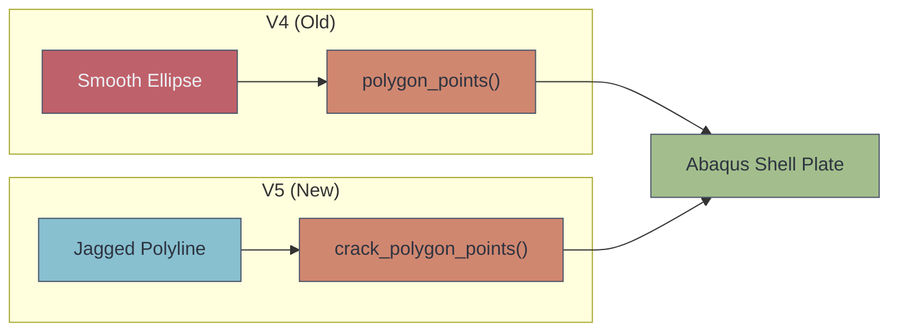
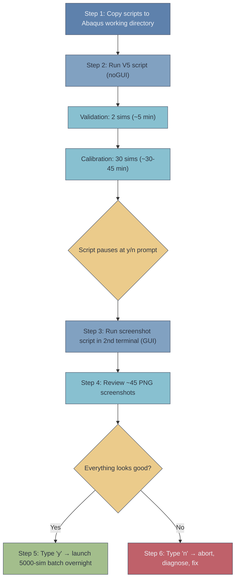

> [!info] Document Metadata
> **Script:** [[run_batch_simulations_v5_cracks.py]]  
> **Post-processing:** [[post_process_screenshots_v5.py]]  
> **Run command:** `abaqus cae noGUI=run_batch_simulations_v5_cracks.py`  
> **Output:** `simulation_results_v5.csv`  
> **Last Updated:** Saturday, 22 February 2026  
> **Related:** [[V4 Fixed ML Results — Corrected Composite Dataset]], [[abaqus_python_guide_rp3]]

---

## Overview

V5 replaces V4's smooth elliptical hole/slit defects with **realistic jagged crack geometry** generated via a random-walk algorithm. The crack centerline is built from short random segments with angular deviations, creating irregular polyline slits that resemble real fatigue cracks in composite panels. The simulation count is scaled from 500 → 5000 for ML training.



> [!warning] V5 is a Separate File
> V4 FIXED was **never modified**. V5 is a clean new script: `run_batch_simulations_v5_cracks.py`. The V4 dataset (500 samples, elliptical holes) remains intact for comparison.

---

## Key Changes from V4 FIXED

### 1. Crack Geometry — The Big Change

Instead of drawing smooth ellipses, V5 generates **jagged polyline cracks** that look like real fatigue damage:

```
Algorithm (crack_polygon_points, lines ~195–310):

1. Start at local position (-half_length, 0)
2. WHILE x_pos < half_length:
     a. Pick random segment length in [0.2, 0.8] mm
     b. Pick random angular deviation in [-45°×roughness, +45°×roughness]
     c. Advance: x += seg × cos(dev),  y += seg × sin(dev)
     d. Append point to centerline
3. Clip final point to half_length (prevent overshoot)
4. Enforce minimum segment count (subdivide if too few points)
5. For each centerline point, offset ± width/2 with taper:
     taper = 1 - |2 × (progress - 0.5)|^1.5,  clamped ≥ 0.10
6. Build closed polygon: upper edge (L→R) + lower edge (R→L)
7. Rotate by crack angle, translate to global (cx, cy)
```

The **roughness parameter** is the key new addition — it controls how jagged the crack is:
- `roughness = 0` → perfectly straight slit (used in validation against Lekhnitskii)
- `roughness = 0.5` → moderate irregularity
- `roughness = 0.9` → heavily jagged, realistic fatigue crack appearance

> [!tip] How This Connects to the Code
> In `run_single_simulation()` (~line 620), each crack is drawn as individual `sketch.Line()` segments forming a closed polygon — replacing V4's `sketch.EllipseByCenterPerimeter()`. Abaqus cuts this polygon out of the plate face, creating the crack-shaped void. The number of line segments depends on crack length and segment size, typically 20–80 segments per crack.

### 2. Per-Defect Parameters (6 instead of 5)

| Parameter | Range | Replaces | Purpose |
|-----------|-------|----------|---------|
| `half_length` | 4–15 mm | `semi_major` | Half tip-to-tip crack length |
| `width` | 0.15–0.6 mm | `aspect_ratio` | Slit width (thin!) |
| `roughness` | 0.15–0.90 | ==**New**== | Controls jaggedness |
| `x` | 15–85 mm | Same (tighter) | Crack centre X |
| `y` | 10–40 mm | Same (tighter) | Crack centre Y |
| `angle` | 0–180° | Same | Crack orientation |

### 3. Scale

- **5000 samples** (1000 per defect count, 1–5 cracks)
- Estimated runtime: 20–40 hours on university machine

### 4. Mesh

- Crack tip mesh: **0.15 mm** (was 0.2 mm in V4) — finer to resolve stress at jagged crack tips
- Search buffer: 3.0 mm for edge detection

### 5. Validation & Calibration

- **Validation:** Straight crack (`roughness=0`) vs Lekhnitskii thin-slit SCF, 30% tolerance
- **Calibration:** 30 test simulations to verify ~50% failure rate before main batch
- Both run **before** the main batch — you see results and visually confirm before committing

---

## Post-Session Fixes (22 Feb 2026 — Code Review)

After the initial V5 script was written, a thorough code review identified four issues. All have been fixed in the current version of the script.

> [!danger] Fix 22 — Dead Code Block Removed
> **What:** ~100 lines of duplicated cleanup + result-building code after a `return None` statement in the exception handler, plus a second `except Exception` block that could never trigger.  
> **Risk:** Not a crash risk (Python ignores unreachable code), but confusing dead weight.  
> **Fix:** Deleted the entire unreachable block. Script went from 1574 → 1510 lines.

> [!warning] Fix 23 — Strict Geometry Check in Validation & Calibration
> **What:** If a crack polygon doesn't cut the plate properly, Abaqus creates multiple faces instead of 1. The original code only printed a warning and continued — silently running a malformed simulation.  
> **Risk:** Wasted compute time on garbage geometry during validation/calibration.  
> **Fix:** Added `strict_geometry=True` parameter. During validation and calibration, face count ≠ 1 now **raises an exception** and aborts that simulation immediately. During the main batch, it still warns but continues (one bad polygon shouldn't kill a 20-hour run).

> [!warning] Fix 24 — MIN_POLYGON_SEGMENTS Actually Enforced
> **What:** The constant `MIN_POLYGON_SEGMENTS = 12` was defined at the top of the script but **never actually used** anywhere.  
> **Risk:** Very short cracks with long segments could produce polygons with only 4–6 edges, causing Abaqus meshing difficulties.  
> **Fix:** After the centerline random walk, if the number of centerline points is less than `MIN_POLYGON_SEGMENTS // 2`, the code now automatically subdivides by inserting midpoints between existing segments.

> [!success] Fix 25 — Calibration Keeps First 3 ODB Files
> **What:** Previously, all 30 calibration ODB files were deleted after running.  
> **Why it matters:** You need to **visually inspect** jagged crack geometry before committing to the batch. Terence specifically requested visual evidence of mesh and stress contours.  
> **Fix:** `Job_8000.odb`, `Job_8001.odb`, `Job_8002.odb` are now kept. Combined with the 2 validation ODBs (`Job_9990.odb`, `Job_9991.odb`), you have **5 ODB files** to inspect before the batch starts.

---

## Automated Screenshot Script

A separate post-processing script captures publication-quality PNG screenshots from the kept ODB files. This is for **Terence's visual evidence requirement** and for Obsidian documentation.

**Script:** [[post_process_screenshots_v5.py]]  
**Run command:** `abaqus cae script=post_process_screenshots_v5.py` (requires GUI)  
**Output:** `screenshots_v5/` folder

> [!tip] Why GUI Mode?
> Abaqus needs a display server to render contour plots. The main V5 script runs headless (`noGUI`), but the screenshot script must run with `script=` (which opens the GUI) to capture viewport images.

### What It Captures (per ODB file)

| View | Description |
|------|-------------|
| `mesh_undeformed` | Undeformed mesh showing crack geometry |
| `mises_contour` | Von Mises stress on deformed shape |
| `S11_contour` | Fibre direction stress ($\sigma_{11}$) |
| `S22_contour` | Transverse stress ($\sigma_{22}$) |
| `hashin_ft` | Hashin fibre tension criterion |
| `hashin_mt` | Hashin matrix tension criterion |
| `displacement` | Displacement magnitude |
| `mesh_deformed` | Deformed mesh with edges |
| `zoomed_crack_mises` | Close-up of crack region with Mises contour |

For 5 ODB files × 9 views = **~45 PNG images** total.

### ODB Files Available for Inspection

| File | Type | Description |
|------|------|-------------|
| `Job_9990.odb` | Validation | Straight crack **perpendicular** to load |
| `Job_9991.odb` | Validation | Straight crack **parallel** to load |
| `Job_8000.odb` | Calibration | Jagged crack (random geometry) |
| `Job_8001.odb` | Calibration | Jagged crack (random geometry) |
| `Job_8002.odb` | Calibration | Jagged crack (random geometry) |

---

## University Session Workflow



### Detailed Steps

**Step 1 (~5 min):** Copy both scripts to the Abaqus working directory on the university machine:
- `run_batch_simulations_v5_cracks.py`
- `post_process_screenshots_v5.py`

**Step 2 (~40-60 min):** Run the V5 script headless:
```
abaqus cae noGUI=run_batch_simulations_v5_cracks.py
```
It runs validation (2 sims) → calibration (30 sims) → ==**stops and waits**== at a `y/n` prompt.

**Step 3 (~10 min):** While V5 is waiting, open a **second terminal** and run:
```
abaqus cae script=post_process_screenshots_v5.py
```
This captures PNGs of all 5 kept ODB files into `screenshots_v5/`.

**Step 4 (~15 min):** Review the screenshots. Check:
- [ ] Mesh quality near crack tips — are elements reasonable?
- [ ] Crack geometry — do the jagged cracks actually look like cracks?
- [ ] Stress concentrations — are they at the crack tips as expected?
- [ ] Deformed shape — is it physically reasonable?
- [ ] Validation SCFs — within 30% of Lekhnitskii prediction?
- [ ] Calibration failure rate — is it 40–60% Tsai-Wu?

**Step 5:** If everything looks good → type `y` to launch the 5000-sim batch. Leave overnight.

**Step 6:** If something looks wrong → type `n`. Copy the screenshots and console output, then diagnose.

> [!danger] Time Budget
> You have ~7-8 hours on the machine. Steps 1–4 take about 1 hour. The batch run takes 20–40 hours. This means you must start the batch **within the first hour** to let it run overnight with maximum time.

---

## What Stayed the Same (All 21 V4 Fixes Carried Forward)

> [!abstract] V4 Foundation
> Every fix from V4 FIXED is present in V5. The only changes are: crack geometry (ellipses → jagged polylines), parameters (5 → 6 per defect), sample count (500 → 5000), and the 4 new fixes above (Fixes 22–25).

- Material: T300/Epoxy (E1=138 GPa, E2=8.96 GPa, G12=7.1 GPa)
- Strengths: XT=1500, XC=1200, YT=40, YC=246, SL=68, ST=68 MPa
- Layup: [0/45/-45/90]s with variable rotation
- Boundary conditions: Roller (U1=0 left edge) + corner pin (U2=U3=0)
- Loading: `ShellEdgeLoad`, symmetric Y if biaxial
- Failure criteria: Tsai-Wu index (manual computation) + Hashin damage initiation
- Pressure range: 5–100 MPa (X), 0–100 MPa (Y)
- Sequential defect placement with retry (zero overlaps guaranteed)
- Latin Hypercube Sampling for global parameters
- CSV resume capability (`load_completed_ids`)
- Command-line solver workaround (`abaqus job=... interactive`)
- Job `.sta` file status check
- Corner pin reaction force diagnostic
- All file cleanup and error handling

---

## CSV Column Changes

V5 has **6 columns per defect** (was 5 in V4):

`defectN_x`, `defectN_y`, `defectN_half_length`, `defectN_width`, `defectN_angle`, `defectN_roughness`

All output columns (stresses, failure indices, displacement, element count) remain identical to V4.

---

## Risk Notes

> [!warning] Meshing Risk
> Very thin jagged polygons may cause meshing difficulties. The 0.15 mm crack tip mesh and `MIN_POLYGON_SEGMENTS` enforcement mitigate this, but some extreme geometries may still fail. The error handler catches these and writes an ERROR row to the CSV — the batch continues.

> [!warning] Geometry Self-Intersection
> With high roughness (0.8–0.9) and short cracks, the random walk could theoretically create a self-intersecting polygon. This would cause Abaqus to create multiple faces. Fix 23 (`strict_geometry`) catches this during validation/calibration. During the batch, the warning is logged and the sim continues.

> [!warning] Failure Rate Shift
> Jagged cracks concentrate stress differently than smooth ellipses. The calibration (30 test sims) checks that failure rate is still 40–60%. If it's outside this range, the script warns you — do **not** proceed with the batch without adjusting `pressure_x` bounds.

---

## Complete Fix History (V4 + V5)

| Fix # | Version | Description |
|:-----:|:-------:|-------------|
| 1–20 | V4 | Original 20 fixes (sequential placement, pressure calibration, PINNED BCs, ShellEdgeLoad, Hashin extraction, etc.) |
| 21 | V4 | All fixes combined into V4 FIXED pipeline |
| ==22== | ==V5== | ==Dead code block removed (~100 lines unreachable code after `return None`)== |
| ==23== | ==V5== | ==Strict geometry check — aborts during validation/calibration if face count ≠ 1== |
| ==24== | ==V5== | ==`MIN_POLYGON_SEGMENTS` enforced — auto-subdivides short centerlines== |
| ==25== | ==V5== | ==Calibration keeps first 3 ODB files for visual inspection== |

---

## File Locations

| File | Location |
|------|----------|
| V5 main script | `03_Abaqus/Scripts/run_batch_simulations_v5_cracks.py` |
| V5 working copy | `03_Abaqus/V5_Cracks/run_batch_simulations_v5_cracks.py` |
| V5 Obsidian copy | `attachments/Scripts/run_batch_simulations_v5_cracks.py` |
| Screenshot script | `03_Abaqus/Scripts/post_process_screenshots_v5.py` |
| Screenshot Obsidian copy | `attachments/Scripts/post_process_screenshots_v5.py` |
| V4 script (unchanged) | `03_Abaqus/V4_N_Holes/run_batch_simulations_v4_composite_FIXED.py` |

---

*Note created: 22 February 2026*  
*Last updated: 22 February 2026 — added Fixes 22–25, screenshot script, university workflow*

#RP3 #V5 #abaqus #crack-geometry #machine-learning #jagged-cracks
